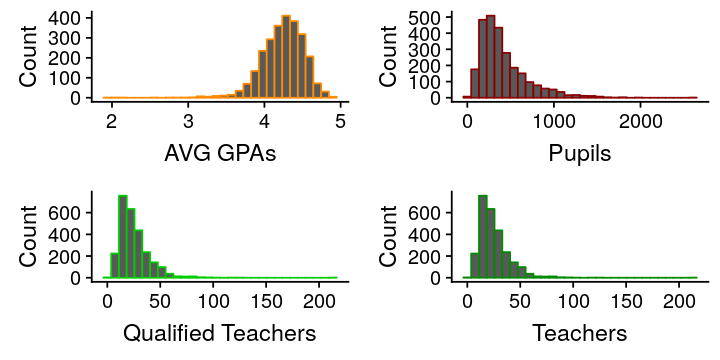
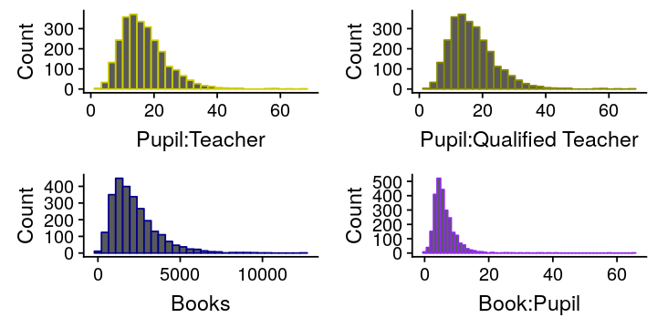
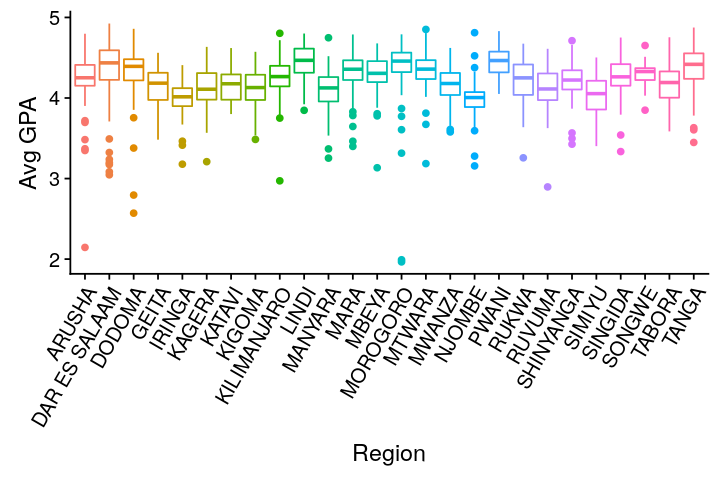
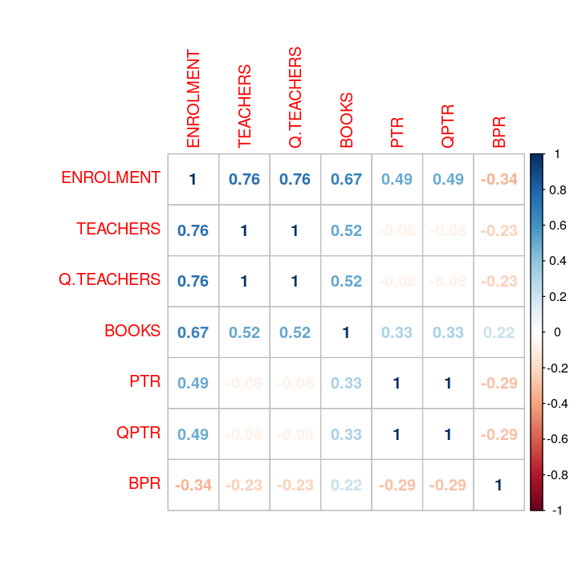
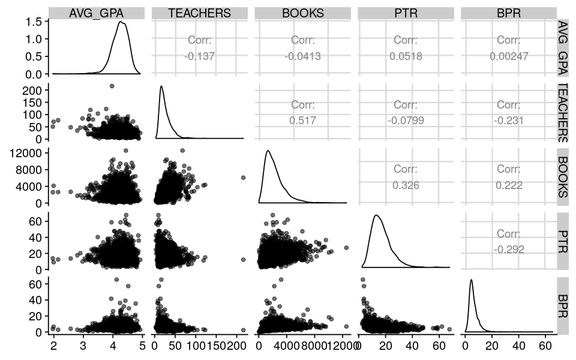

# Is there a relationship between average Tanzanian school performance on the Form IV National Exams and student access to textbooks and teachers?

The Tanzanian Government has a variety of education, health and agriculture datasets available at their [Basic Statistics Portal](http://http://opendata.go.tz/).  Of interest for this exploratory data analysis are four datasets, namely:

* [2016 Certificate of Secondary Education Exam Results](http://opendata.go.tz/dataset/national-form-four-examinations-schools-ranking-with-location) - Form IV examination results for all ordinary level secondary schools in Tanzania.  We are interested in the AVG_GPA attribute, which corresponds to the average division results of the examinations.  The division results range from 1 to 5, with 1 being the best and 5 being the worst.  [Mirrored here.](2016CSEE-RANKINGWITHLOC.csv)
* [2016 Qualified Teacher to Pupil Ratio for Government Secondary Schools](http://opendata.go.tz/dataset/qualified) - Contains the total number of qualified teachers for each school.  We are interested in the total number of students and qualified teachers from this dataset.  [Mirrored here.](QPTR-Governmet-Secondary-Schools-2016.csv)
* [2016 Pupil to Teacher Ratio for Government Secondary Schools](http://opendata.go.tz/dataset/uwiano-wa-mwalimu-kwa-wanafunzi-kwa-shule-za-sekondari-za-serikali-2016) - Contains the total number of teachers for each school.  We are interested in the total number of students and teachers from this dataset.  [Mirrored here.](PTR-in-Gvt-Secondary-Schools-2016.csv)
* [2018 Pupil to Book Ratio for Secondary Schools](http://opendata.go.tz/dataset/pbr-secondary-2018) - We are interested in the total number of books from this data set.  [Mirrored here.](PBRSecondary-Education.csv)

## Data Cleaning

For this analysis we will need to merge the attributes from these individual datasets into a single dataframe.

### Importing the necessary libraries

```R
# Import the libraries
library(ggplot2)
suppressMessages(library(dplyr))
suppressMessages(library(tidyr))
suppressMessages(library(cowplot))
suppressMessages(library(GGally))
suppressMessages(library(corrplot))
```

### Importing the Datasets

```R
# Read in the CSEE Results cleaning the whitespace
df_csee = read.csv('2016CSEE-RANKINGWITHLOC.csv', header=TRUE,
                   strip.white=TRUE)
head(df_csee, 2)
cat('CSEE data points:', nrow(df_csee))
```
><table>
<thead><tr><th>CODE</th><th>NAME</th><th>REGION</th><th>DISTRICT</th><th>WARD</th><th>OWNERSHIP</th><th>LATITUDE</th><th>LONGITUDE</th><th>PASS_RATE</th><th>CHANGE_PREVIOUS_YEAR_PASS_RATE</th><th>AVG_GPA</th><th>CHANGE_PREVIOUS_YEAR_GPA</th><th>RANK</th><th>YEAR_OF_RESULT</th><th>MORE_THAN_40</th><th>NATIONAL_RANK_ALL</th><th>REGIONAL_RANK_ALL</th><th>DISTRICT_RANK_ALL</th></tr></thead>
<tbody>
	<tr><td>S0189                             </td><td>FEZA BOYS' SECONDARY SCHOOL       </td><td>DAR ES SALAAM                     </td><td>KINONDONI                         </td><td>KUNDUCHI                          </td><td>PRIVATE                           </td><td>-6.73805                          </td><td>39.2281                           </td><td>100                               </td><td>0                                 </td><td>1.4769                            </td><td>0.1514                            </td><td>YES                               </td><td>1                                 </td><td>2016                              </td><td>1                                 </td><td>1                                 </td><td>1                                 </td></tr>
	<tr><td>S0239                             </td><td>ST. FRANCIS GIRLS SECONDARY SCHOOL</td><td>MBEYA                             </td><td>MBEYA (M)                         </td><td>MBALIZI RD                        </td><td>PRIVATE                           </td><td>-8.90662                          </td><td>33.4503                           </td><td>100                               </td><td>0                                 </td><td>1.4896                            </td><td>0.0062                            </td><td>YES                               </td><td>2                                 </td><td>2016                              </td><td>2                                 </td><td>1                                 </td><td>1                                 </td></tr>
</tbody>
</table>
CSEE data points: 4360

```R
# Read in the PTR data
df_ptr = read.csv('PTR-in-Gvt-Secondary-Schools-2016.csv', header=TRUE,
                  strip.white=TRUE)
head(df_ptr, 2)
cat('Teachers data points:', nrow(df_ptr))
```
<table>
<thead><tr><th>REGION</th><th>COUNCIL</th><th>WARD</th><th>SCHOOL.NAME</th><th>ENROLMENT</th><th>TEACHERS</th><th>PTR</th></tr></thead>
<tbody>
	<tr><td>ARUSHA   </td><td>Arusha CC</td><td>Kimandolu</td><td>KIMASEKI </td><td>1205     </td><td>53       </td><td>23       </td></tr>
	<tr><td>ARUSHA   </td><td>Arusha CC</td><td>Kimandolu</td><td>SUYE     </td><td> 918     </td><td>39       </td><td>24       </td></tr>
</tbody>
</table>
>Teachers data points: 3600

```R
# Read in the QPTR data
df_qptr = read.csv('QPTR-Governmet-Secondary-Schools-2016.csv', header=TRUE,
                   strip.white=TRUE)
head(df_qptr, 2)
cat('Teachers number of rows:', nrow(df_qptr))
```
<table>
<thead><tr><th>REGION</th><th>COUNCIL</th><th>WARD</th><th>SCHOOL.NAME</th><th>ENROLMENT</th><th>TEACHERS</th><th>QPTR</th></tr></thead>
<tbody>
	<tr><td>ARUSHA   </td><td>Arusha CC</td><td>Kimandolu</td><td>KIMASEKI </td><td>1205     </td><td>52       </td><td>23       </td></tr>
	<tr><td>ARUSHA   </td><td>Arusha CC</td><td>Kimandolu</td><td>SUYE     </td><td> 918     </td><td>39       </td><td>24       </td></tr>
</tbody>
</table>
>Teachers number of rows: 3600

```R
# Read in the PBR data
df_pbr = read.csv('PBRSecondary-Education.csv', header=TRUE, strip.white=TRUE)
head(df_pbr, 2)
cat('Books number of rows:', nrow(df_pbr))
```
<table>
<thead><tr><th>Region</th><th>Council</th><th>Ward</th><th>School.Name</th><th>Number.of.Students.Basic.Mathematics.Form.1</th><th>Number.of.Students.Biology.Form.1</th><th>Number.of.Students.Chemistry.Form.1</th><th>Number.of.Students.Civics.Form.1</th><th>Number.of.Students.English.Language.Form.1</th><th>Number.of.Students.Geography.Form.1</th><th>⋯</th><th>PBR.Biology.Form.6</th><th>PBR.Chemistry.Form.6</th><th>PBR.Economics.Form.6</th><th>PBR.English.Language.Form.6</th><th>PBR.General.Studies.Form.6</th><th>PBR.Geography.Form.6</th><th>PBR.History.Form.6</th><th>PBR.Kiswahili.Form.6</th><th>PBR.Literature.in.English.Form.6</th><th>PBR.Physics.Form.6</th></tr></thead>
<tbody>
	<tr><td>ARUSHA  </td><td>Arusha  </td><td>Bangata </td><td>BANG'ATA</td><td>151     </td><td>151     </td><td>151     </td><td>151     </td><td>151     </td><td>151     </td><td>⋯       </td><td>NA      </td><td>NA      </td><td>NA      </td><td>NA      </td><td>NA      </td><td>NA      </td><td>NA      </td><td>NA      </td><td>NA      </td><td>NA      </td></tr>
	<tr><td>ARUSHA  </td><td>Arusha  </td><td>Bwawani </td><td>OLOKII  </td><td>132     </td><td>132     </td><td>132     </td><td>132     </td><td>132     </td><td>132     </td><td>⋯       </td><td>NA      </td><td>NA      </td><td>NA      </td><td>NA      </td><td>NA      </td><td>NA      </td><td>NA      </td><td>NA      </td><td>NA      </td><td>NA      </td></tr>
</tbody>
</table>
>Books number of rows: 3632

Most of the datasets do not contain the same number of schools, which should be okay for this exploratory analysis.  When we merge them we will lose some data points, but if we find a strong relationship we can come back to find ways to include matching schools that may have not have merged automatically.  Prior to merging, though, let's make sure that there are no duplicate schools listed in any of the datasets.

```R
# Check for duplicates in CSEE
duplicates = df_csee$CODE
cat('CSEE duplicates:', df_csee[duplicated(df_csee)])
```
>CSEE duplicates:

```R
# Check for duplicates in PTR
# Create a column that concatenates the REGION, COUNCIL, WARD and SCHOOL.NAME
df_ptr = df_ptr %>% unite(UNQ.SCH, REGION, COUNCIL, WARD, SCHOOL.NAME, remove = FALSE)
duplicates = df_ptr$UNQ.SCH
cat('Qualified teachers duplicate schools:', duplicates[duplicated(duplicates)])
```
>Qualified teachers duplicate schools: GEITA_Geita_Lwenzera_LWEZELA

```R
# Check for duplicates in QPTR
# Create a column that concatenates the REGION, COUNCIL, WARD and SCHOOL.NAME
df_qptr = df_ptr %>% unite(UNQ.SCH, REGION, COUNCIL, WARD, SCHOOL.NAME, remove = FALSE)
duplicates = df_qptr$UNQ.SCH
cat('All teachers duplicate schools:', duplicates[duplicated(duplicates)])
```
>All teachers duplicate schools: GEITA_Geita_Lwenzera_LWEZELA

```R
# Check for duplicates in PBR
# Create a column that concatenates the Region, Council, Ware and School.Name
df_pbr = df_pbr %>% unite(UNQ.SCH, Region, Council, Ward, School.Name, remove = FALSE)
duplicates = df_pbr$UNQ.SCH
cat('Textbooks duplicate schools:', duplicates[duplicated(duplicates)])
```
>Textbooks duplicate schools:

Only the PTR and QTR datasets have a single school listed twice.  Let's remove the duplicate entry.

```R
# Remove the duplicate rows
df_qptr = distinct(df_qptr, UNQ.SCH, .keep_all = TRUE)
df_ptr = distinct(df_ptr, UNQ.SCH, .keep_all = TRUE)
# Show the number of rows after removing duplicate schools
cat('Qualified teachers number of rows:', nrow(df_qptr))
cat('\nAll teachers number of rows:', nrow(df_ptr))
```
>Qualified teachers number of rows: 3599
>All teachers number of rows: 3599

### Syncing Column Names

Now that each dataset is cleaned, we need sync the column names that we will use to merge the datasets.  Region, Ward and School Name exist is all four datasets, so we can use these attributes to merge them.

```R
# Extract the CODE, REGION, WARD, NAME, and AVG_GPA from the CSEE dataset
df_schools = df_csee[c('CODE', 'REGION','WARD','NAME','AVG_GPA')]
# Drop ' Secondary School' from the school name
df_schools$NAME = sub(' SECONDARY SCHOOL', '', df_schools$NAME)
# Rename NAME Column to SCHOOL.NAME
names(df_schools)[names(df_schools) == 'NAME'] <- 'SCHOOL.NAME'

# Extract the attributes from the QPTR dataset
df_tmp = df_qptr[c('REGION','SCHOOL.NAME','ENROLMENT','TEACHERS')]
# Merge PTR with our cleaned dataset
df_schools = inner_join(df_schools, df_tmp, by=c('REGION','SCHOOL.NAME'))
# Rename TEACHERS Column to Q.TEACHERS
names(df_schools)[names(df_schools) == 'TEACHERS'] <- 'Q.TEACHERS'

# Extract the attributes from the PTR dataset
df_tmp = df_ptr[c('REGION','SCHOOL.NAME','TEACHERS')]
# Merge PTR with our cleaned dataset
df_schools = inner_join(df_schools, df_tmp, by=c('REGION','SCHOOL.NAME'))

# Duplicate the PBR dataset
df_tmp = df_pbr
# Drop student counts
df_tmp = df_tmp %>% select(-contains('Students'))
# Drop PBR columns
df_tmp = df_tmp %>% select(-contains('PBR'))
# Drop Form 5 columns
df_tmp = df_tmp %>% select(-contains('Form.5'))
# Drop Form 6 columns
df_tmp = df_tmp %>% select(-contains('Form.6'))
# Convert NA values to zero
df_tmp[is.na(df_tmp)] = 0
# Sum the text books of each school
df_tmp = df_tmp %>% mutate(sumrow=rowSums(.[6:ncol(df_tmp)]))
# Extract the attributes from the PTR dataset
df_tmp = df_tmp[c('Region','School.Name','sumrow')]
# Rename Region Column to REGION
names(df_tmp)[names(df_tmp) == 'Region'] <- 'REGION'
# Rename School.Name Column to SCHOOL.NAME
names(df_tmp)[names(df_tmp) == 'School.Name'] <- 'SCHOOL.NAME'
# Rename sumrow Column to BOOKS
names(df_tmp)[names(df_tmp) == 'sumrow'] <- 'BOOKS'

# Merge PTR with our cleaned dataset
df_schools = inner_join(df_schools, df_tmp, by=c('REGION','SCHOOL.NAME'))

# Convert REGION to a factor
df_schools$REGION = as.factor(df_schools$REGION)
# Convert CODE to characters
df_schools$CODE = as.character(df_schools$CODE)

head(df_schools, 2)
cat('Total Schools:', nrow(df_schools))
```
<table>
<thead><tr><th>CODE</th><th>REGION</th><th>WARD</th><th>SCHOOL.NAME</th><th>AVG_GPA</th><th>ENROLMENT</th><th>Q.TEACHERS</th><th>TEACHERS</th><th>BOOKS</th></tr></thead>
<tbody>
	<tr><td>S0140   </td><td>MOROGORO</td><td>MZUMBE  </td><td>MZUMBE  </td><td>1.9654  </td><td>703     </td><td>51      </td><td>51      </td><td>2589    </td></tr>
	<tr><td>S0206   </td><td>MOROGORO</td><td>KILAKALA</td><td>KILAKALA</td><td>1.9917  </td><td>636     </td><td>71      </td><td>71      </td><td>4132    </td></tr>
</tbody>
</table>
>Total Schools: 2670

After merging all four datasets, we remain with 2670 schools.  As we are performing cursory exploratory data analysis, this should be large enough to determine if there are correlations between the teacher and book attributes and school performance on national examinations.

Let's make sure that there are no duplicate schools in our merged dataset.

```R
# Check for duplicates in df_schools
# Create a column that concatenates the Region, Council, Ware and School.Name
df_tmp = df_schools %>% unite(UNQ.SCH, REGION, WARD, SCHOOL.NAME, remove = FALSE)
duplicates = df_tmp$UNQ.SCH
cat('Duplicate schools:', duplicates[duplicated(duplicates)])
```
>Duplicate schools:

### Creating Interaction Terms

Great, now we can create a couple of interaction terms that could help with leveling the comparisons between schools.  We will create interaction terms for:

* pupil to qualified teacher ratio
* pupil to teacher ratio
* book to pupil ratio

```R
# Set the pupil to teacher ratios
df_schools$QPTR = round(df_schools$ENROLMENT / df_schools$Q.TEACHERS,2)
df_schools$PTR = round(df_schools$ENROLMENT / df_schools$TEACHERS,2)
# Set the book to pupil ratio
df_schools$BPR = round(df_schools$BOOKS / df_schools$ENROLMENT,2)

head(df_schools,2)
```
<table>
<thead><tr><th>CODE</th><th>REGION</th><th>WARD</th><th>SCHOOL.NAME</th><th>AVG_GPA</th><th>ENROLMENT</th><th>Q.TEACHERS</th><th>TEACHERS</th><th>BOOKS</th><th>QPTR</th><th>PTR</th><th>BPR</th></tr></thead>
<tbody>
	<tr><td>S0140   </td><td>MOROGORO</td><td>MZUMBE  </td><td>MZUMBE  </td><td>1.9654  </td><td>703     </td><td>51      </td><td>51      </td><td>2589    </td><td>13.78   </td><td>13.78   </td><td>3.68    </td></tr>
	<tr><td>S0206   </td><td>MOROGORO</td><td>KILAKALA</td><td>KILAKALA</td><td>1.9917  </td><td>636     </td><td>71      </td><td>71      </td><td>4132    </td><td> 8.96   </td><td> 8.96   </td><td>6.50    </td></tr>
</tbody>
</table>

## Exploratory Data Analysis

```R
summary(df_schools)
```
>CODE                   REGION            WARD      SCHOOL.NAME       
>Length:2670        TANGA      : 179            : 188   Length:2670       
>Class :character   KILIMANJARO: 174   CHANIKA  :  10   Class :character  
>Mode  :character   MWANZA     : 158   KIBAMBA  :   5   Mode  :character  
>                   DODOMA     : 148   KITUNDA  :   5                     
>                   MOROGORO   : 144   MAKUYUNI :   5                     
>                   MARA       : 134   MALANGALI:   5                     
>                   (Other)    :1733   (Other)  :2452                     
>   AVG_GPA        ENROLMENT        Q.TEACHERS        TEACHERS     
>Min.   :1.965   Min.   :  29.0   Min.   :  3.00   Min.   :  3.00  
>1st Qu.:4.080   1st Qu.: 222.0   1st Qu.: 15.25   1st Qu.: 15.25  
>Median :4.262   Median : 342.0   Median : 22.00   Median : 22.00  
>Mean   :4.240   Mean   : 416.9   Mean   : 25.26   Mean   : 25.26  
>3rd Qu.:4.434   3rd Qu.: 525.8   3rd Qu.: 31.00   3rd Qu.: 31.00  
>Max.   :4.924   Max.   :2633.0   Max.   :216.00   Max.   :216.00  
>
>    BOOKS             QPTR            PTR             BPR         
>Min.   :     0   Min.   : 2.54   Min.   : 2.54   Min.   :  0.000  
>1st Qu.:  1204   1st Qu.:11.62   1st Qu.:11.62   1st Qu.:  3.890  
>Median :  1890   Median :15.68   Median :15.68   Median :  5.360  
>Mean   :  2270   Mean   :16.83   Mean   :16.83   Mean   :  6.261  
>3rd Qu.:  2826   3rd Qu.:20.66   3rd Qu.:20.66   3rd Qu.:  7.500  
>Max.   :159666   Max.   :67.67   Max.   :67.67   Max.   :341.170  

There appears to be at least one spurious outlier in the total books attribute.  While we could run Grubbs' Test to identify outliers, there is not a need since this is just exploratory.  In the summary above we can see that the maximum record is 159666 books for a single school.  This is almost certainly from incorrectly entered value(s) within the dataset.  Let's remove any book totals over 20,000.

```R
# Remove schools with book counts greater than 20,000
df_schools = subset(df_schools, BOOKS<20000 & BOOKS>0)
```

### Checking for normality

Let's graph a few histograms of the predictors to visually inspect normality of the variables.

```R
# Set the image dimensions
options(repr.plot.width=6, repr.plot.height=3)
# Histogram of AVG GPAs
hst_gpa = ggplot(data=df_schools, aes(AVG_GPA)) +
    geom_histogram(bins=30, color='darkorange') +
    xlab('AVG GPAs') + ylab('Count')
# Histogram of Pupils
hst_pup = ggplot(data=df_schools, aes(ENROLMENT)) +
    geom_histogram(bins=30, color='darkred') +
    xlab('Pupils') + ylab('Count')
# Histogram of Teachers
hst_qtch = ggplot(data=df_schools, aes(TEACHERS)) +
    geom_histogram(bins=30, color='green4') +
    xlab('Teachers') + ylab('Count')
# Histogram of Qualified Teachers
hst_tch = ggplot(data=df_schools, aes(Q.TEACHERS)) +
    geom_histogram(bins=30, color='green3') +
    xlab('Qualified Teachers') + ylab('Count')
# Grid them together
plot_grid(hst_gpa, hst_pup, hst_tch, hst_qtch, ncol=2)
```


AVG GPA appears to be left skewed, and Pupils, Qualified Teachers, and Teachers appear to be right skewed.  The other thing to notice is that Qualified Teachers and Teachers have very similar distributions.  We will check for multicollinearity a little later.

```R
# Histogram of PTR
hst_ptr = ggplot(data=df_schools, aes(PTR)) +
    geom_histogram(bins=30, color='yellow3') +
    xlab('Pupil:Teacher') + ylab('Count')
# Histogram of PTR
hst_qptr = ggplot(data=df_schools, aes(QPTR)) +
    geom_histogram(bins=30, color='yellow4') +
    xlab('Pupil:Qualified Teacher') + ylab('Count')
# Histogram of Books
hst_bks=ggplot(data=df_schools, aes(BOOKS)) +
    geom_histogram(bins=30, color='darkblue') +
    xlab('Books') + ylab('Count')
# Histogram of BPR
hst_bpr=ggplot(data=df_schools, aes(BPR)) +
    geom_histogram(bins=60, color='purple2') +
    xlab('Book:Pupil') + ylab('Count')
# Grid them together
plot_grid(hst_ptr, hst_qptr, hst_bks, hst_bpr, ncol=2)
```


We can see that books and all three interaction terms are right skewed.

#### Shapiro-Wilk Test for Normality

The Shapiro-Wilk Test can also test for normality.  Given the null hypothesis that the data are normally distributed, a low p-value will indicate that the data are not normally distributed.

```R
# Run the Shapiro Tests
sw_results <- shapiro.test(df_schools$AVG_GPA)
cat('AVG_GPA Shapiro-Wilk p-value:', sw_results$p.value)
sw_results <- shapiro.test(df_schools$ENROLMENT)
cat('\nENROLMENT Shapiro-Wilk p-value:', sw_results$p.value)
sw_results <- shapiro.test(df_schools$TEACHERS)
cat('\nTEACHERS Shapiro-Wilk p-value:', sw_results$p.value)
sw_results <- shapiro.test(df_schools$Q.TEACHERS)
cat('\nQ.TEACHERS Shapiro-Wilk p-value:', sw_results$p.value)
sw_results <- shapiro.test(df_schools$BOOKS)
cat('\nBOOKS Shapiro-Wilk p-value:', sw_results$p.value)
sw_results <- shapiro.test(df_schools$PTR)
cat('\nPTR Shapiro-Wilk p-value:', sw_results$p.value)
sw_results <- shapiro.test(df_schools$QPTR)
cat('\nQPTR Shapiro-Wilk p-value:', sw_results$p.value)
sw_results <- shapiro.test(df_schools$BPR)
cat('\nBPR Shapiro-Wilk p-value:', sw_results$p.value)
```
>AVG_GPA Shapiro-Wilk p-value: 4.787988e-31
>ENROLMENT Shapiro-Wilk p-value: 1.089899e-43
>TEACHERS Shapiro-Wilk p-value: 1.572752e-45
>Q.TEACHERS Shapiro-Wilk p-value: 1.572752e-45
>BOOKS Shapiro-Wilk p-value: 1.976691e-40
>PTR Shapiro-Wilk p-value: 9.180728e-34
>QPTR Shapiro-Wilk p-value: 9.180728e-34
>BPR Shapiro-Wilk p-value: 2.943717e-53

According to the Shapiro-Wilk test, none of the attributes follow a normal distribution.  There are ways to reshape the data, but let's leave the attributes alone for now.

### Affect of Region on AVG_GPA

Let's investigate if the region has an affect on the AVG_GPA.  First we'll visually explore the AVG_GPA by Region.

```R
# Set the image dimensions
options(repr.plot.width=6, repr.plot.height=4)
# Create boxplot of avg gpa against region
ggplot(df_schools, aes(x=REGION, y=AVG_GPA, color=REGION)) +
    geom_boxplot(width = 0.8) +
    guides(color=FALSE) +
    theme(
            axis.text.x = element_text(angle=60, hjust = 1)
    ) +
    xlab('Region') +
    ylab('Avg GPA')
```


Arusha and Morogoro have the top performing schools in our cleaned dataset.  Njombe and Iringa appear to have the best median scores.  Let's use ANOVA to see if the Regions have statistically different AVG_GPA values. The null hypothesis is that all of the means of the Regions are the same.  Let's see if at least one of the means of AVG_GPA for the Regions is different.

```R
model = lm(AVG_GPA ~ REGION, df_schools)
anova(model)
```
<table>
<thead><tr><th></th><th>Df</th><th>Sum Sq</th><th>Mean Sq</th><th>F value</th><th>Pr(&gt;F)</th></tr></thead>
<tbody>
	<tr><th scope=row>REGION</th><td>  25         </td><td> 39.8802     </td><td>1.59520807   </td><td>24.84854     </td><td>3.893503e-102</td></tr>
	<tr><th scope=row>Residuals</th><td>2587         </td><td>166.0783     </td><td>0.06419724   </td><td>      NA     </td><td>           NA</td></tr>
</tbody>
</table>

With a p-value so close to zero for the F-Test statistic, we can reject the null hypothesis that all of the means of AVG_GPA are the same for the Regions.  It appears that at least one Region has a statistically significant different mean value for the AVG_GPA than the rest.  However, we should be aware that with such a large dataset, it was likely that we would find statistically significant evidence to reject the null hypothesis.

### Multicollinearity

Let's see if there is any multicollinearity among the predictors.

```R
# Set the image dimensions
options(repr.plot.width=6, repr.plot.height=6)
# Create a list of predictors
predictors = c('ENROLMENT', 'TEACHERS', 'Q.TEACHERS', 'BOOKS',
               'PTR', 'QPTR', 'BPR')
# Plot the correlation matrix
corrplot(cor(df_schools[predictors]), method = "number")
```


There is direct correlation between teachers and qualified teachers, which means that moving forward we can ignore one of them.  So let's ignore Q.TEACHERS and QPTR since nearly all schools have all or nearly all qualified teachers on staff.

We can also see that ENROLMENT correlates strongly with most other predictors, so let's ignore it as well to reduce the influence of multicollinearity on the model.

### Checking Correlations of the Predictors with the Response

Let's see the scatterplots of the predictors and the response as well as how much they correlate.

```R
# Set the image dimensions
options(repr.plot.width=8, repr.plot.height=5)
# Plot the corelations between the attributes
ggpairs(df_schools[c('AVG_GPA','TEACHERS','BOOKS','PTR','BPR')],
        aes(alpha=0.1))
```


There appears to be very little correlation between AVG_GPA of schools and the predictors, TEACHERS, BOOKS, PTR, and BPR.  PTR has the greatest positive correlation at 0.05 and TEACHERS has the greatest negative correlation at -0.137.

We can also see that the scatterplots of AVG_GPA against the predictors do not appear have any obvious positive or negative linear trends.

We can see this directly by creating a multiple linear regression model of these predictors.

```R
model = lm(AVG_GPA ~ TEACHERS+BOOKS+PTR+BPR, df_schools)
summary(model)
```
>Call:
>lm(formula = AVG_GPA ~ TEACHERS + BOOKS + PTR + BPR, data = df_schools)
>
>Residuals:
>     Min       1Q   Median       3Q      Max
>-2.19564 -0.16012  0.02275  0.19165  0.68787
>
>Coefficients:
>              Estimate Std. Error t value Pr(>|t|)    
>(Intercept)  4.328e+00  2.877e-02 150.410  < 2e-16 ***
>TEACHERS    -3.649e-03  5.972e-04  -6.111 1.14e-09 ***
>BOOKS        1.326e-05  6.576e-06   2.017   0.0438 *  
>PTR         -9.194e-06  1.030e-03  -0.009   0.9929    
>BPR         -4.062e-03  2.030e-03  -2.001   0.0455 *  
>---
>Signif. codes:  0 ‘ *** ’ 0.001 ‘ ** ’ 0.01 ‘ * ’ 0.05 ‘.’ 0.1 ‘ ’ 1
>
>Residual standard error: 0.2779 on 2608 degrees of freedom
>Multiple R-squared:  0.0223,	Adjusted R-squared:  0.0208
>F-statistic: 14.87 on 4 and 2608 DF,  p-value: 5.105e-12

From the R-squared value, only 2% of the variation in AVG_GPA is explained by the predictors TEACHERS, BOOKS, PTR, and BPR.

Even running a full model using nearly all predictors improves the R-squared value by less than a tenth of a percent.

```R
model = lm(AVG_GPA ~ . - CODE - WARD - SCHOOL.NAME, df_schools)
summary(model)
````
<pre class="output">Call:
lm(formula = AVG_GPA ~ . - CODE - WARD - SCHOOL.NAME, data = df_schools)

Residuals:
     Min       1Q   Median       3Q      Max
-2.34632 -0.12222  0.02372  0.16089  0.88265

Coefficients: (2 not defined because of singularities)
                      Estimate Std. Error t value Pr(>|t|)    
(Intercept)          4.408e+00  4.356e-02 101.205  < 2e-16 ***
REGIONDAR ES SALAAM  1.022e-01  3.886e-02   2.630 0.008599 **
REGIONDODOMA         2.503e-02  3.633e-02   0.689 0.490896    
REGIONGEITA         -1.350e-01  3.996e-02  -3.380 0.000737 ***
REGIONIRINGA        -2.677e-01  3.906e-02  -6.854 8.98e-12 ***
REGIONKAGERA        -1.871e-01  3.679e-02  -5.084 3.95e-07 ***
REGIONKATAVI        -1.474e-01  5.573e-02  -2.646 0.008206 **
REGIONKIGOMA        -1.866e-01  3.848e-02  -4.849 1.32e-06 ***
REGIONKILIMANJARO   -2.258e-02  3.482e-02  -0.648 0.516778    
REGIONLINDI          1.292e-01  4.090e-02   3.159 0.001604 **
REGIONMANYARA       -2.071e-01  4.083e-02  -5.074 4.18e-07 ***
REGIONMARA           1.328e-02  3.687e-02   0.360 0.718733    
REGIONMBEYA          3.914e-02  3.633e-02   1.077 0.281403    
REGIONMOROGORO       1.306e-01  3.576e-02   3.652 0.000266 ***
REGIONMTWARA         3.743e-02  3.914e-02   0.956 0.339075    
REGIONMWANZA        -9.397e-02  3.523e-02  -2.668 0.007684 **
REGIONNJOMBE        -2.613e-01  4.181e-02  -6.250 4.77e-10 ***
REGIONPWANI          1.919e-01  4.115e-02   4.662 3.29e-06 ***
REGIONRUKWA         -7.642e-02  4.351e-02  -1.757 0.079118 .  
REGIONRUVUMA        -1.774e-01  3.822e-02  -4.641 3.64e-06 ***
REGIONSHINYANGA     -9.059e-02  4.129e-02  -2.194 0.028338 *  
REGIONSIMIYU        -2.849e-01  4.501e-02  -6.330 2.88e-10 ***
REGIONSINGIDA       -4.106e-02  3.894e-02  -1.055 0.291701    
REGIONSONGWE         1.591e-03  5.580e-02   0.029 0.977260    
REGIONTABORA        -1.311e-01  3.829e-02  -3.425 0.000625 ***
REGIONTANGA          8.363e-02  3.517e-02   2.378 0.017489 *  
ENROLMENT            6.632e-05  5.836e-05   1.137 0.255843    
Q.TEACHERS          -5.363e-03  9.374e-04  -5.722 1.18e-08 ***
TEACHERS                    NA         NA      NA       NA    
BOOKS                1.027e-05  6.357e-06   1.615 0.106427    
QPTR                -1.096e-03  1.350e-03  -0.812 0.416840    
PTR                         NA         NA      NA       NA    
BPR                 -3.156e-03  1.886e-03  -1.673 0.094390 .  
---
Signif. codes:  0 ‘ *** ’ 0.001 ‘ ** ’ 0.01 ‘ * ’ 0.05 ‘.’ 0.1 ‘ ’ 1

Residual standard error: 0.2489 on 2582 degrees of freedom
Multiple R-squared:  0.2234,	Adjusted R-squared:  0.2144
F-statistic: 24.76 on 30 and 2582 DF,  p-value: < 2.2e-16</pre>

## Conclusion

From this exploratory data analysis it is clear that the number of students, books and teachers, including interaction terms, are not good predictors for the average student performance of the schools.

### Possible Next Steps

I suspect that there are other factors that would be better predictors of school performance.  Socio-economic data, such as the parent's education and income levels, family size.  The average number student-day absences would also be a potentially good predictor, since I would expect that attendance plays a role in exam performance.  I would also be curious if the proximity of the school to a health clinic would have any correlation with student performance.  The health clinic could serve as a proxy to the access of the students to government services.  However, these data are not currently available on the Basic Statistics Portal website.
