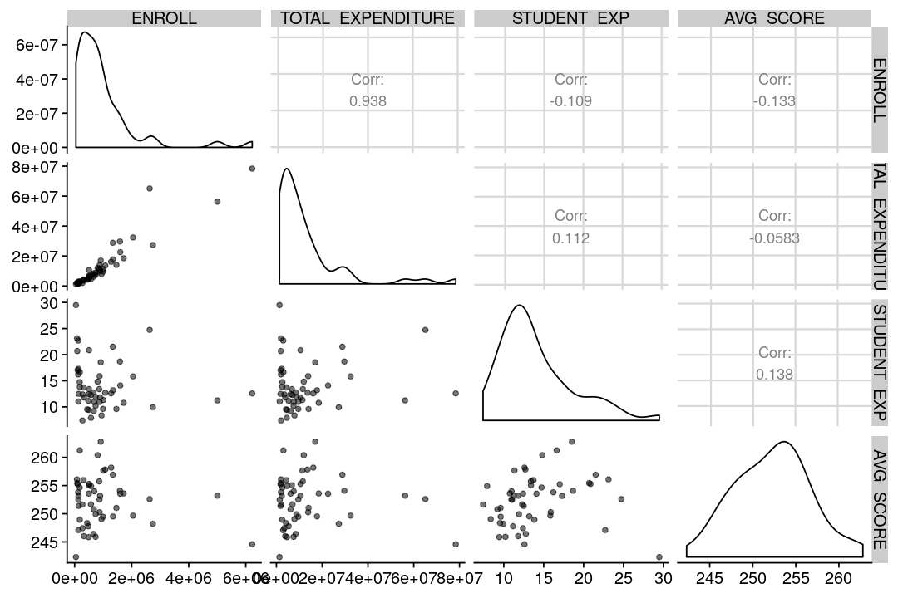
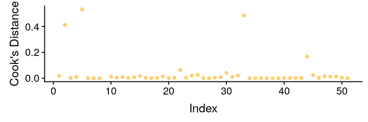
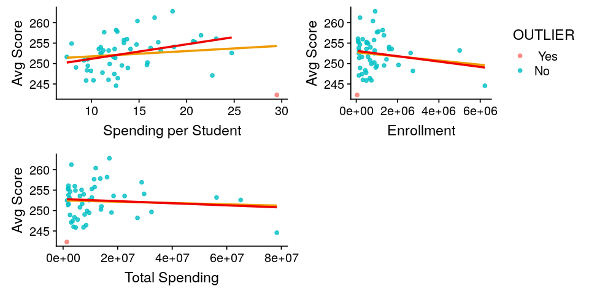
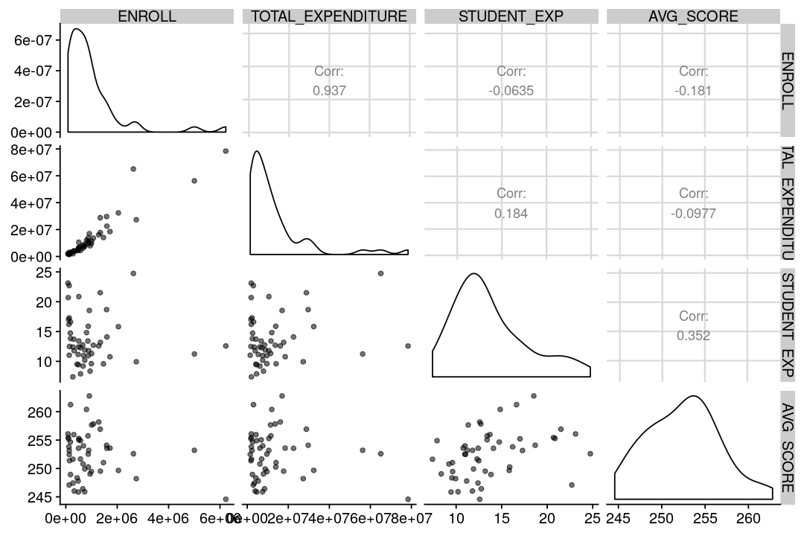

# Is there a relationship between U.S. state spending, enrollment, and examination results?
---

This dataset comes from Kaggle's [U.S. Education Datasets: Unification Project](https://www.kaggle.com/noriuk/us-education-datasets-unification-project).  They provide numerous U.S. education datasets following that link.  This exploratory data analysis uses the [states_all.csv](states_all.csv) dataset.

We will be looking at spending and examination results for the 50 states in 2015.  For this analysis, we will only look at how total spending per student affected the total average student scores.

## Data Cleaning and Preprocessing


```R
# Import the libraries
suppressMessages(library(dplyr))
suppressMessages(library(car))
suppressMessages(library(GGally))
suppressMessages(library(cowplot))

# Read in the data
df_edu = read.csv('states_all.csv', header=TRUE)
# Show the first few rows
head(df_edu,3)
```

<table>
<thead><tr><th>PRIMARY_KEY</th><th>STATE</th><th>YEAR</th><th>ENROLL</th><th>TOTAL_REVENUE</th><th>FEDERAL_REVENUE</th><th>STATE_REVENUE</th><th>LOCAL_REVENUE</th><th>TOTAL_EXPENDITURE</th><th>INSTRUCTION_EXPENDITURE</th><th>⋯</th><th>GRADES_4_G</th><th>GRADES_8_G</th><th>GRADES_12_G</th><th>GRADES_1_8_G</th><th>GRADES_9_12_G</th><th>GRADES_ALL_G</th><th>AVG_MATH_4_SCORE</th><th>AVG_MATH_8_SCORE</th><th>AVG_READING_4_SCORE</th><th>AVG_READING_8_SCORE</th></tr></thead>
<tbody>
	<tr><td>1992_ALABAMA</td><td>ALABAMA     </td><td>1992        </td><td>NA          </td><td>2678885     </td><td>304177      </td><td>1659028     </td><td> 715680     </td><td>2653798     </td><td>1481703     </td><td>⋯           </td><td>57948       </td><td>58025       </td><td>41167       </td><td>471564      </td><td>196386      </td><td>676174      </td><td>208.3279    </td><td>252.1875    </td><td>207.9635    </td><td>      NA    </td></tr>
	<tr><td>1992_ALASKA </td><td>ALASKA      </td><td>1992        </td><td>NA          </td><td>1049591     </td><td>106780      </td><td> 720711     </td><td> 222100     </td><td> 972488     </td><td> 498362     </td><td>⋯           </td><td> 9748       </td><td> 8789       </td><td> 6714       </td><td> 79117      </td><td> 30847      </td><td>112335      </td><td>      NA    </td><td>      NA    </td><td>      NA    </td><td>258.8597    </td></tr>
	<tr><td>1992_ARIZONA</td><td>ARIZONA     </td><td>1992        </td><td>NA          </td><td>3258079     </td><td>297888      </td><td>1369815     </td><td>1590376     </td><td>3401580     </td><td>1435908     </td><td>⋯           </td><td>55433       </td><td>49081       </td><td>37410       </td><td>437127      </td><td>175210      </td><td>614881      </td><td>215.2539    </td><td>265.3663    </td><td>206.2127    </td><td>262.1699    </td></tr>
</tbody>
</table>

Let's filter for only 2015 data points.

```R
# Grab the 2015 data points
df_2015 = df_edu %>% filter(grepl('2015_',PRIMARY_KEY))

# Show the data frame
cat('Total Rows:', nrow(df_2015))
head(df_2015, 3)
```
<div class="output">
<pre>
Total Rows: 57
</pre>
</div>

<table>
<thead><tr><th>PRIMARY_KEY</th><th>STATE</th><th>YEAR</th><th>ENROLL</th><th>TOTAL_REVENUE</th><th>FEDERAL_REVENUE</th><th>STATE_REVENUE</th><th>LOCAL_REVENUE</th><th>TOTAL_EXPENDITURE</th><th>INSTRUCTION_EXPENDITURE</th><th>⋯</th><th>GRADES_4_G</th><th>GRADES_8_G</th><th>GRADES_12_G</th><th>GRADES_1_8_G</th><th>GRADES_9_12_G</th><th>GRADES_ALL_G</th><th>AVG_MATH_4_SCORE</th><th>AVG_MATH_8_SCORE</th><th>AVG_READING_4_SCORE</th><th>AVG_READING_8_SCORE</th></tr></thead>
<tbody>
	<tr><td>2015_ALABAMA</td><td>ALABAMA     </td><td>2015        </td><td>734974      </td><td>7360222     </td><td> 795238     </td><td>4080167     </td><td>2484817     </td><td>7501799     </td><td>3817479     </td><td>⋯           </td><td>55808       </td><td>55792       </td><td>50668       </td><td>452764      </td><td>222182      </td><td> 688176     </td><td>230.9774    </td><td>266.5553    </td><td>217.0491    </td><td>269.0200    </td></tr>
	<tr><td>2015_ALASKA </td><td>ALASKA      </td><td>2015        </td><td>130755      </td><td>2920986     </td><td> 344111     </td><td>2026555     </td><td> 550320     </td><td>2968341     </td><td>1484610     </td><td>⋯           </td><td>10118       </td><td> 9400       </td><td> 9651       </td><td> 80011      </td><td> 38688      </td><td> 122068     </td><td>236.3284    </td><td>280.4935    </td><td>212.7926    </td><td>258.7538    </td></tr>
	<tr><td>2015_ARIZONA</td><td>ARIZONA     </td><td>2015        </td><td>944978      </td><td>8230507     </td><td>1093834     </td><td>3232013     </td><td>3904660     </td><td>7902600     </td><td>3846357     </td><td>⋯           </td><td>86594       </td><td>84084       </td><td>84854       </td><td>687144      </td><td>333579      </td><td>1029470     </td><td>237.6118    </td><td>282.9195    </td><td>215.3113    </td><td>260.3170    </td></tr>
</tbody>
</table>

There are 57 data points because in addition to the 50 states, there are also data points for:

* District of Columbia
* Bureau of Indian Education
* American Samoa
* Dept. Defense Education Activity
* Guam
* Puerto Rico
* U.S. Virgin Islands

Let's filter for the columns of interest.

```R
# Show the column names
colnames(df_2015)
```

<div class="output">
<pre>
'PRIMARY_KEY' 'STATE' 'YEAR' 'ENROLL' 'TOTAL_REVENUE' 'FEDERAL_REVENUE'
'STATE_REVENUE' 'LOCAL_REVENUE' 'TOTAL_EXPENDITURE' 'INSTRUCTION_EXPENDITURE'
'SUPPORT_SERVICES_EXPENDITURE' 'OTHER_EXPENDITURE' 'CAPITAL_OUTLAY_EXPENDITURE'
'GRADES_PK_G' 'GRADES_KG_G' 'GRADES_4_G' 'GRADES_8_G' 'GRADES_12_G'
'GRADES_1_8_G' 'GRADES_9_12_G' 'GRADES_ALL_G' 'AVG_MATH_4_SCORE'
'AVG_MATH_8_SCORE' 'AVG_READING_4_SCORE' 'AVG_READING_8_SCORE'
</pre>
</div>

```R
cols = c('STATE', 'ENROLL', 'TOTAL_EXPENDITURE',
         'AVG_MATH_4_SCORE', 'AVG_MATH_8_SCORE', 'AVG_READING_4_SCORE',
         'AVG_READING_8_SCORE')
df_2015 = df_2015[,cols]
cat('Total Rows:', nrow(df_2015))
head(df_2015,3)
```
<div class="output">
<pre>
Total Rows: 57
</pre>
</div>

<table>
<thead><tr><th>STATE</th><th>ENROLL</th><th>TOTAL_EXPENDITURE</th><th>AVG_MATH_4_SCORE</th><th>AVG_MATH_8_SCORE</th><th>AVG_READING_4_SCORE</th><th>AVG_READING_8_SCORE</th></tr></thead>
<tbody>
	<tr><td>ALABAMA </td><td>734974  </td><td>7501799 </td><td>230.9774</td><td>266.5553</td><td>217.0491</td><td>269.0200</td></tr>
	<tr><td>ALASKA  </td><td>130755  </td><td>2968341 </td><td>236.3284</td><td>280.4935</td><td>212.7926</td><td>258.7538</td></tr>
	<tr><td>ARIZONA </td><td>944978  </td><td>7902600 </td><td>237.6118</td><td>282.9195</td><td>215.3113</td><td>260.3170</td></tr>
</tbody>
</table>

Let's drop rows with NA

```R
# Drop NA values
df_2015 = na.omit(df_2015)

cat('Total Rows:', nrow(df_2015))
```
<div class="output">
<pre>
Total Rows: 51
</pre>
</div>

We have 51 rows, which includes all 50 states and the District of Columbia.  Finally, we will calculate the average score and create an expense per student inteaction term.

### Interaction Terms

* Average of all scores
* Expense per student values

```R
# Get the total average score
df_2015$AVG_SCORE = (df_2015$AVG_MATH_4_SCORE + df_2015$AVG_MATH_8_SCORE +
                        df_2015$AVG_READING_4_SCORE +
                        df_2015$AVG_READING_8_SCORE) / 4
# Get the total expenditure per student
df_2015$STUDENT_EXP = df_2015$TOTAL_EXPENDITURE / df_2015$ENROLL

# Grab only the expenditure per student and the total average score
df_2015edu = df_2015[c('STATE','ENROLL', 'TOTAL_EXPENDITURE',
                       'AVG_SCORE', 'STUDENT_EXP')]
head(df_2015edu, 3)
```

<table>
<thead><tr><th>STATE</th><th>ENROLL</th><th>TOTAL_EXPENDITURE</th><th>AVG_SCORE</th><th>STUDENT_EXP</th></tr></thead>
<tbody>
	<tr><td>ALABAMA  </td><td>734974   </td><td>7501799  </td><td>245.9005 </td><td>10.206890</td></tr>
	<tr><td>ALASKA   </td><td>130755   </td><td>2968341  </td><td>247.0921 </td><td>22.701549</td></tr>
	<tr><td>ARIZONA  </td><td>944978   </td><td>7902600  </td><td>249.0399 </td><td> 8.362734</td></tr>
</tbody>
</table>

## Exploratory Data Analysis

Let's look at the correlation between the quantitative variables.

```R
# Set the image dimensions
options(repr.plot.width=9, repr.plot.height=6)
# Plot the corelations between the attributes
ggpairs(df_2015edu[c('ENROLL', 'TOTAL_EXPENDITURE',
                     'STUDENT_EXP', 'AVG_SCORE')], aes(alpha=0.1))
```



There is small positive correlation (0.14) between spending per student and average test scores.  Enrollment and total expenditures appear to be highly correlated with a 0.938 correlation factor.  Looking at the scatterplots above, there my be outliers in the dataset.

### Outliers

Let's look at the regression lines on the full dataset and attempt to identify any outliers.

```R
# Get the regression line on the full dataset
model = lm(AVG_SCORE ~ STUDENT_EXP+ENROLL+TOTAL_EXPENDITURE, df_2015edu)
summary(model)
```

<div class="output">
<pre>
Call:
lm(formula = AVG_SCORE ~ STUDENT_EXP + ENROLL + TOTAL_EXPENDITURE,
    data = df_2015edu)

Residuals:
     Min       1Q   Median       3Q      Max
-10.5942  -2.7054   0.4069   2.6033   9.7606

Coefficients:
                    Estimate Std. Error t value Pr(>|t|)    
(Intercept)        2.526e+02  2.556e+00  98.815   <2e-16 ***
STUDENT_EXP        8.227e-03  1.707e-01   0.048    0.962    
ENROLL            -2.421e-06  1.987e-06  -1.218    0.229    
TOTAL_EXPENDITURE  1.476e-07  1.436e-07   1.028    0.309    
---
Signif. codes:  0 ‘ *** ’ 0.001 ‘ ** ’ 0.01 ‘ * ’ 0.05 ‘.’ 0.1 ‘ ’ 1

Residual standard error: 4.377 on 47 degrees of freedom
Multiple R-squared:  0.05441,	Adjusted R-squared:  -0.005946
F-statistic: 0.9015 on 3 and 47 DF,  p-value: 0.4476
</pre>
</div>

```R
# Create the scatterplots of score vs the predictors
plt_std = ggplot(df_2015edu,aes(x=STUDENT_EXP,y=AVG_SCORE)) +
    geom_point(alpha=0.5) +
    geom_smooth(method = "lm", se = FALSE, color='orange2') +
    xlab('Spending per Student') +
    ylab('Avg Score')
plt_enr = ggplot(df_2015edu,aes(x=ENROLL,y=AVG_SCORE)) +
    geom_point(alpha=0.5) +
    geom_smooth(method = "lm", se = FALSE, color='orange2') +
    xlab('Enrollment') +
    ylab('Avg Score')
plt_tot = ggplot(df_2015edu,aes(x=TOTAL_EXPENDITURE,y=AVG_SCORE)) +
    geom_point(alpha=0.5) +
    geom_smooth(method = "lm", se = FALSE, color='orange2') +
    xlab('Total Spending') +
    ylab('Avg Score')

# Set the image dimensions
options(repr.plot.width=8, repr.plot.height=4)
# Grid them together
plot_grid(plt_std, plt_enr, plt_tot, ncol=2)
```


It looks like there may be one or more outliers that are influential points.  We will use Cook's Distance with a threshold of 1 to identify and remove any outliers.

```R
# Set the analysis dataframe
analysis = df_2015edu
# Set the image dimensions
options(repr.plot.width=6, repr.plot.height=2)
# Compute Cook's distance
analysis$cooks = cooks.distance(model)
# Store the index as a column for plotting
analysis$idx <- as.numeric(row.names(analysis))
# Cook's Distance Plot
ggplot(analysis, aes(x=idx, y=cooks)) +
    geom_point(alpha=0.5, color="orange") +
    xlab('Index') +
    ylab('Cook\'s Distance')
# Show the outliers
cat('Cook\'s Distance identified outliers:')
analysis[analysis$cooks > 1,]
```

<div class="output">
<pre>
Cook's Distance identified outliers:
</pre>
</div>

<table>
<thead><tr><th></th><th>STATE</th><th>ENROLL</th><th>TOTAL_EXPENDITURE</th><th>AVG_SCORE</th><th>STUDENT_EXP</th><th>cooks</th><th>idx</th></tr></thead>
<tbody>
	<tr><th>9</th><td>DISTRICT_OF_COLUMBIA</td><td>  46155             </td><td> 1360942            </td><td>242.3215            </td><td>29.48634            </td><td>1.357719            </td><td> 9                  </td></tr>
	<tr><th>33</th><td>NEW_YORK            </td><td>2631532             </td><td>65094591            </td><td>252.5965            </td><td>24.73639            </td><td>1.291653            </td><td>33                  </td></tr>
</tbody>
</table>


The District of Columbia is the largest outlier.  Let's remove it and see if New York is still considered an outlier.

```R
# Remove DC
df_2015states = df_2015edu[df_2015edu$STATE != 'DISTRICT_OF_COLUMBIA',]
# Create the new linear regression model without DC
model2 = lm(AVG_SCORE ~ STUDENT_EXP+ENROLL+TOTAL_EXPENDITURE, df_2015states)
summary(model2)
```

<div class="output">
<pre>
Call:
lm(formula = AVG_SCORE ~ STUDENT_EXP + ENROLL + TOTAL_EXPENDITURE,
    data = df_2015states)

Residuals:
    Min      1Q  Median      3Q     Max
-9.3152 -2.4630 -0.0966  2.2729  8.6239

Coefficients:
                    Estimate Std. Error t value Pr(>|t|)    
(Intercept)        2.477e+02  2.727e+00  90.828   <2e-16 ***
STUDENT_EXP        3.882e-01  1.914e-01   2.028   0.0483 *  
ENROLL             4.331e-08  1.943e-06   0.022   0.9823    
TOTAL_EXPENDITURE -4.706e-08  1.423e-07  -0.331   0.7424    
---
Signif. codes:  0 ‘ *** ’ 0.001 ‘ ** ’ 0.01 ‘ * ’ 0.05 ‘.’ 0.1 ‘ ’ 1

Residual standard error: 3.964 on 46 degrees of freedom
Multiple R-squared:  0.151,	Adjusted R-squared:  0.09563
F-statistic: 2.727 on 3 and 46 DF,  p-value: 0.05479
</pre>
</div>

After removing the District of Columbia from the dataset, STUDENT_EXP has become a significant predictor.  Much more significant than the other two predictors. Let's see if any outliers remain.

```R
# Set the analysis dataframe
analysis = df_2015states
# Set the image dimensions
options(repr.plot.width=6, repr.plot.height=2)
# Compute Cook's distance
analysis$cooks = cooks.distance(model2)
# Store the index as a column for plotting
analysis$idx <- as.numeric(row.names(analysis))
# Cook's Distance Plot
ggplot(analysis, aes(x=idx, y=cooks)) +
    geom_point(alpha=0.5, color="orange") +
    xlab('Index') +
    ylab('Cook\'s Distance')
# Show the outliers
cat('Cook\'s Distance identified outliers:')
analysis[analysis$cooks > 1,]
```

<div class="output">
<pre>
Cook's Distance identified outliers:
</pre>
</div>

<table>
<thead><tr><th>STATE</th><th>ENROLL</th><th>TOTAL_EXPENDITURE</th><th>AVG_SCORE</th><th>STUDENT_EXP</th><th>cooks</th><th>idx</th></tr></thead>
<tbody>
</tbody>
</table>



With the District of Columbia removed from the dataset, Cook's Distance does not identify any remaining states as outliers, including New York.

Let's replot the regression line after ignoring the outlier.

```R
# Specify the outlier
df_2015edu$OUTLIER = ifelse(df_2015edu$STUDENT_EXP > 26, ' Yes', 'No')

# Create the scatterplots of score vs the predictors
plt_std = ggplot(df_2015edu,aes(x=STUDENT_EXP,y=AVG_SCORE, color=OUTLIER)) +
    geom_point(alpha=0.8) +
    geom_smooth(method = "lm", se = FALSE, color='orange2') +
    geom_smooth(method = "lm", se = FALSE, color='red2',
                data=df_2015states) +
    xlab('Spending per Student') +
    ylab('Avg Score') +
    theme(legend.position="none")
plt_enr = ggplot(df_2015edu,aes(x=ENROLL,y=AVG_SCORE, color=OUTLIER)) +
    geom_point(alpha=0.8) +
    geom_smooth(method = "lm", se = FALSE, color='orange2') +
    geom_smooth(method = "lm", se = FALSE, color='red2',
                data=df_2015states) +
    xlab('Enrollment') +
    ylab('Avg Score')
plt_tot = ggplot(df_2015edu,aes(x=TOTAL_EXPENDITURE,y=AVG_SCORE,
                                color=OUTLIER)) +
    geom_point(alpha=0.8) +
    geom_smooth(method = "lm", se = FALSE, color='orange2') +
    geom_smooth(method = "lm", se = FALSE, color='red2',
                data=df_2015states) +
    xlab('Total Spending') +
    ylab('Avg Score') +
    theme(legend.position="none")

# Set the image dimensions
options(repr.plot.width=8, repr.plot.height=4)
# Grid them together
plot_grid(plt_std, plt_enr, plt_tot, ncol=2)
```



The red regression lines are calculated after removing DC.  It appears that when estimating AVG_SCORE from STUDENT_EXP, DC is an influential outlier.  However, for ENROLL and TOTAL_EXPENDITURE, DC does not appear to be influential.

DC, not being a state, is an influential outlier when considering the full model using all predictors, and should be removed.  It has the most spending per student *and* the lowest average score of all of the data points.

How is the correlation between the variables affected after removing DC?

```R
# Set the image dimensions
options(repr.plot.width=9, repr.plot.height=6)
# Plot the corelations between the attributes
ggpairs(df_2015states[c('ENROLL', 'TOTAL_EXPENDITURE',
                     'STUDENT_EXP', 'AVG_SCORE')], aes(alpha=0.1))
```



Removing DC from the dataset has more than doubled the correlation between the STUDENT_EXP and AVG_SCORE from 0.14 to 0.35.  The other two predictors do not appear to have increased in correlation as well, although only a few percent.

Predictor|cor(AVG_SCORE)|cor(AVG_SCORE) without DC
-|-|-
STUDENT_EXP|0.138|0.352
TOTAL_EXPENDITURE|-0.0583|-0.0977
ENROLL|-0.133|-0.181

There appears to be a positively trending relationship between the average spending per student and the average score on examinations.  [Download the finalized dataset here](states2015.csv).

Let's continue with creating and [evaluating a simple linear regression model using only the spending per student as a predictor of average student scores.](/modeling/us_state_education)
