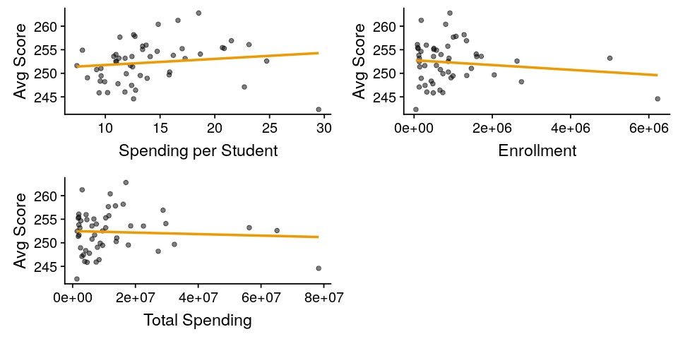

# US State Education Spending and Examination Results
---

This dataset comes from Kaggle's [U.S. Education Datasets: Unification Project](https://www.kaggle.com/noriuk/us-education-datasets-unification-project).

We will be looking at spending and examination results for the 50 states in 2015.  For this analysis, we will only look at how total spending per student affected the total average student scores.

## Data Cleaning and Preprocessing


```R
# Import the libraries
suppressMessages(library(dplyr))
suppressMessages(library(car))
suppressMessages(library(GGally))
# Read in the data
df_edu = read.csv('states_all.csv', header=TRUE)
# Show the first few rows
head(df_edu,3)
```

<table>
<thead><tr><th>PRIMARY_KEY</th><th>STATE</th><th>YEAR</th><th>ENROLL</th><th>TOTAL_REVENUE</th><th>FEDERAL_REVENUE</th><th>STATE_REVENUE</th><th>LOCAL_REVENUE</th><th>TOTAL_EXPENDITURE</th><th>INSTRUCTION_EXPENDITURE</th><th>⋯</th><th>GRADES_4_G</th><th>GRADES_8_G</th><th>GRADES_12_G</th><th>GRADES_1_8_G</th><th>GRADES_9_12_G</th><th>GRADES_ALL_G</th><th>AVG_MATH_4_SCORE</th><th>AVG_MATH_8_SCORE</th><th>AVG_READING_4_SCORE</th><th>AVG_READING_8_SCORE</th></tr></thead>
<tbody>
	<tr><td>1992_ALABAMA</td><td>ALABAMA     </td><td>1992        </td><td>NA          </td><td>2678885     </td><td>304177      </td><td>1659028     </td><td> 715680     </td><td>2653798     </td><td>1481703     </td><td>⋯           </td><td>57948       </td><td>58025       </td><td>41167       </td><td>471564      </td><td>196386      </td><td>676174      </td><td>208.3279    </td><td>252.1875    </td><td>207.9635    </td><td>      NA    </td></tr>
	<tr><td>1992_ALASKA </td><td>ALASKA      </td><td>1992        </td><td>NA          </td><td>1049591     </td><td>106780      </td><td> 720711     </td><td> 222100     </td><td> 972488     </td><td> 498362     </td><td>⋯           </td><td> 9748       </td><td> 8789       </td><td> 6714       </td><td> 79117      </td><td> 30847      </td><td>112335      </td><td>      NA    </td><td>      NA    </td><td>      NA    </td><td>258.8597    </td></tr>
	<tr><td>1992_ARIZONA</td><td>ARIZONA     </td><td>1992        </td><td>NA          </td><td>3258079     </td><td>297888      </td><td>1369815     </td><td>1590376     </td><td>3401580     </td><td>1435908     </td><td>⋯           </td><td>55433       </td><td>49081       </td><td>37410       </td><td>437127      </td><td>175210      </td><td>614881      </td><td>215.2539    </td><td>265.3663    </td><td>206.2127    </td><td>262.1699    </td></tr>
</tbody>
</table>

Let's filter for only 2015 data points.

```R
# Grab the 2015 data points
df_2015 = df_edu %>% filter(grepl('2015_',PRIMARY_KEY))

# Show the data frame
cat('Total Rows:', nrow(df_2015))
head(df_2015, 3)
```
<div class="output">
<pre>
Total Rows: 57
</pre>
</div>

<table>
<thead><tr><th>PRIMARY_KEY</th><th>STATE</th><th>YEAR</th><th>ENROLL</th><th>TOTAL_REVENUE</th><th>FEDERAL_REVENUE</th><th>STATE_REVENUE</th><th>LOCAL_REVENUE</th><th>TOTAL_EXPENDITURE</th><th>INSTRUCTION_EXPENDITURE</th><th>⋯</th><th>GRADES_4_G</th><th>GRADES_8_G</th><th>GRADES_12_G</th><th>GRADES_1_8_G</th><th>GRADES_9_12_G</th><th>GRADES_ALL_G</th><th>AVG_MATH_4_SCORE</th><th>AVG_MATH_8_SCORE</th><th>AVG_READING_4_SCORE</th><th>AVG_READING_8_SCORE</th></tr></thead>
<tbody>
	<tr><td>2015_ALABAMA</td><td>ALABAMA     </td><td>2015        </td><td>734974      </td><td>7360222     </td><td> 795238     </td><td>4080167     </td><td>2484817     </td><td>7501799     </td><td>3817479     </td><td>⋯           </td><td>55808       </td><td>55792       </td><td>50668       </td><td>452764      </td><td>222182      </td><td> 688176     </td><td>230.9774    </td><td>266.5553    </td><td>217.0491    </td><td>269.0200    </td></tr>
	<tr><td>2015_ALASKA </td><td>ALASKA      </td><td>2015        </td><td>130755      </td><td>2920986     </td><td> 344111     </td><td>2026555     </td><td> 550320     </td><td>2968341     </td><td>1484610     </td><td>⋯           </td><td>10118       </td><td> 9400       </td><td> 9651       </td><td> 80011      </td><td> 38688      </td><td> 122068     </td><td>236.3284    </td><td>280.4935    </td><td>212.7926    </td><td>258.7538    </td></tr>
	<tr><td>2015_ARIZONA</td><td>ARIZONA     </td><td>2015        </td><td>944978      </td><td>8230507     </td><td>1093834     </td><td>3232013     </td><td>3904660     </td><td>7902600     </td><td>3846357     </td><td>⋯           </td><td>86594       </td><td>84084       </td><td>84854       </td><td>687144      </td><td>333579      </td><td>1029470     </td><td>237.6118    </td><td>282.9195    </td><td>215.3113    </td><td>260.3170    </td></tr>
</tbody>
</table>

There are 57 data points.  In addition to the 50 states, there are also data points for:

* District of Columbia
* Bureau of Indian Education
* American Samoa
* Dept. Defense Education Activity
* Guam
* Puerto Rico
* U.S. Virgin Islands

Let's filter for the columns of interest.

```R
# Show the column names
colnames(df_2015)
```
<div class="output">
<pre>
'PRIMARY_KEY' 'STATE' 'YEAR' 'ENROLL' 'TOTAL_REVENUE' 'FEDERAL_REVENUE' 'STATE_REVENUE' 'LOCAL_REVENUE' 'TOTAL_EXPENDITURE' 'INSTRUCTION_EXPENDITURE' 'SUPPORT_SERVICES_EXPENDITURE' 'OTHER_EXPENDITURE' 'CAPITAL_OUTLAY_EXPENDITURE' 'GRADES_PK_G' 'GRADES_KG_G' 'GRADES_4_G' 'GRADES_8_G' 'GRADES_12_G' 'GRADES_1_8_G' 'GRADES_9_12_G' 'GRADES_ALL_G' 'AVG_MATH_4_SCORE' 'AVG_MATH_8_SCORE' 'AVG_READING_4_SCORE' 'AVG_READING_8_SCORE'</li>
</pre>
</div>

```R
cols = c('STATE', 'ENROLL', 'TOTAL_EXPENDITURE',
         'AVG_MATH_4_SCORE', 'AVG_MATH_8_SCORE', 'AVG_READING_4_SCORE',
         'AVG_READING_8_SCORE')
df_2015 = df_2015[,cols]
cat('Total Rows:', nrow(df_2015))
head(df_2015,3)
```
<div class="output">
<pre>
Total Rows: 57
</pre>
</div>

<table>
<thead><tr><th>STATE</th><th>ENROLL</th><th>TOTAL_EXPENDITURE</th><th>AVG_MATH_4_SCORE</th><th>AVG_MATH_8_SCORE</th><th>AVG_READING_4_SCORE</th><th>AVG_READING_8_SCORE</th></tr></thead>
<tbody>
	<tr><td>ALABAMA </td><td>734974  </td><td>7501799 </td><td>230.9774</td><td>266.5553</td><td>217.0491</td><td>269.0200</td></tr>
	<tr><td>ALASKA  </td><td>130755  </td><td>2968341 </td><td>236.3284</td><td>280.4935</td><td>212.7926</td><td>258.7538</td></tr>
	<tr><td>ARIZONA </td><td>944978  </td><td>7902600 </td><td>237.6118</td><td>282.9195</td><td>215.3113</td><td>260.3170</td></tr>
</tbody>
</table>

Let's drop rows with NA

```R
# Drop NA values
df_2015 = na.omit(df_2015)

cat('Total Rows:', nrow(df_2015))
```
<div class="output">
<pre>
    Total Rows: 51
<div class="output">
<pre>

We have 51 rows, which includes all 50 states and the District of Columbia.  Finally, we will calculate the average score and create an expense per student inteaction term.

### Interaction Terms

* Average of all scores
* Expense per student values

```R
# Get the total average score
df_2015$AVG_SCORE = (df_2015$AVG_MATH_4_SCORE + df_2015$AVG_MATH_8_SCORE +
                        df_2015$AVG_READING_4_SCORE +
                        df_2015$AVG_READING_8_SCORE) / 4
# Get the total expenditure per student
df_2015$AVG_TOT_EXP = df_2015$TOTAL_EXPENDITURE / df_2015$ENROLL

# Grab only the expenditure per student and the total average score
df_2015edu = df_2015[c('STATE','AVG_SCORE', 'AVG_TOT_EXP')]
head(df_2015edu, 3)
```

<table>
<thead><tr><th>STATE</th><th>AVG_SCORE</th><th>AVG_TOT_EXP</th></tr></thead>
<tbody>
	<tr><td>ALABAMA  </td><td>245.9005 </td><td>10.206890</td></tr>
	<tr><td>ALASKA   </td><td>247.0921 </td><td>22.701549</td></tr>
	<tr><td>ARIZONA  </td><td>249.0399 </td><td> 8.362734</td></tr>
</tbody>
</table>

## Exploratory Data Analysis

Let's look at the correlation between the average score of a state and the state's averge expenditure per student.

```R
# Set the image dimensions
options(repr.plot.width=8, repr.plot.height=5)
# Plot the corelations between the attributes
ggpairs(df_2015edu[c('AVG_SCORE', 'AVG_TOT_EXP')], aes(alpha=0.1))
```


### Outliers

The scatterplot above indicates that we may have a few outliers within our dataset.  Let's look at the regression line on the full dataset and attempt to identify any outliers.

```R
# Get the regression line on the full dataset
model = lm(AVG_SCORE ~ AVG_TOT_EXP, df_2015edu)
# Get the coefficients
x0 = model$coeff[[1]]
x1 = model$coeff[[2]]
# Create the scatterplot of score vs expenditure
# with the regression line
options(repr.plot.width=4, repr.plot.height=3)
ggplot(df_2015edu,aes(x=AVG_TOT_EXP,y=AVG_SCORE)) +
    geom_point(alpha=0.5) +
    geom_abline(intercept = x0, slope = x1, color='red2') +
    xlab('Average Total Spending per Student') +
    ylab('Average Score') +
    ggtitle('Score vs Spending')
```



It looks like a few of the outliers are influential outliers that are pulling the regression line down.  We will use Cook's Distance to identify any outliers.  We will use a cutoff of 1, so any observation with Cook's Distance greater than 1 will be identified and removed.

```R
# Set the analysis dataframe
analysis = df_2015edu
# Set the image dimensions
options(repr.plot.width=6, repr.plot.height=2)
# Compute Cook's distance
analysis$cooks = cooks.distance(model)
# Store the index as a column for plotting
analysis$idx <- as.numeric(row.names(analysis))
# Cook's Distance Plot
ggplot(analysis, aes(x=idx, y=cooks)) +
    geom_point(alpha=0.5, color="orange") +
    xlab('Index') +
    ylab('Cook\'s Distance')
# Show the outliers
cat('Cook\'s Distance identified outliers:')
analysis[analysis$cooks > 1,]
```

<div class="output">
<pre>
Cook's Distance identified outliers:
<div class="output">
<pre>

<table>
<thead><tr><th></th><th>STATE</th><th>AVG_SCORE</th><th>AVG_TOT_EXP</th><th>cooks</th><th>idx</th></tr></thead>
<tbody>
	<tr><th scope=row>9</th><td>DISTRICT_OF_COLUMBIA</td><td>242.3215            </td><td>29.48634            </td><td>1.56384             </td><td>9                   </td></tr>
</tbody>
</table>


The District of Columbia is an outlier.  Let's remove it and keep only the original 50 states.

```R
# Remove DC
df_2015states = df_2015edu[df_2015edu$STATE != 'DISTRICT_OF_COLUMBIA',]
# Create the new linear regression model
model2 = lm(AVG_SCORE ~ AVG_TOT_EXP, df_2015states)
# Set the analysis dataframe
analysis = df_2015states
# Set the image dimensions
options(repr.plot.width=6, repr.plot.height=2)
# Compute Cook's distance
analysis$cooks = cooks.distance(model2)
# Store the index as a column for plotting
analysis$idx <- as.numeric(row.names(analysis))
# Cook's Distance Plot
ggplot(analysis, aes(x=idx, y=cooks)) +
    geom_point(alpha=0.5, color="orange") +
    xlab('Index') +
    ylab('Cook\'s Distance')
# Show the outliers
cat('Cook\'s Distance identified outliers:')
analysis[analysis$cooks > 1,]
```
<div class="output">
<pre>
Cook's Distance identified outliers:
<div class="output">
<pre>

<table>
<thead><tr><th>STATE</th><th>AVG_SCORE</th><th>AVG_TOT_EXP</th><th>cooks</th><th>idx</th></tr></thead>
<tbody>
</tbody>
</table>


After removing the District of Columbia from the dataset, rerunning Cook's Distance has not identified any additional outliers.

Let's replot the regression line after ignoring the outlier.

```R
# Get the coefficients of the model without the outlier
xb0 = model2$coeff[[1]]
xb1 = model2$coeff[[2]]
# Specify the outlier
df_2015edu$OUTLIER = ifelse(df_2015edu$AVG_TOT_EXP > 26, ' Yes', 'No')
# Create the scatterplot of score vs expenditure
# with the regression line
options(repr.plot.width=6, repr.plot.height=4)
ggplot(df_2015edu,aes(x=AVG_TOT_EXP,y=AVG_SCORE, color=OUTLIER)) +
    geom_point(alpha=0.5) +
    geom_abline(intercept = x0, slope = x1, color='red2') +
    annotate("text", 19, 251.5, label = "Original Regression Line",
             color='red2') +
    geom_abline(intercept = xb0, slope = xb1,
                color='orange3') +
    annotate("text", 23, 259, label = "Dropped Outlier Regression Line",
             color='orange3') +
    xlab('Average Total Spending per Student') +
    ylab('Average Score') +
    ggtitle('Score vs Spending')
```


The trend of the regression line after dropping the outlier is in line with the remaining data points much better than the original regression line.  The outlier for the District of Columbia is clearly an influential point.

DC is not a state and it is the capital of the country.  It is clearly not in line with the other states.  It has the most spending per student and the lowest average score of all of the data points.

Let's continue with creating and [evaluating a simple linear regression model using just the states.](/modeling/us_state_education)
