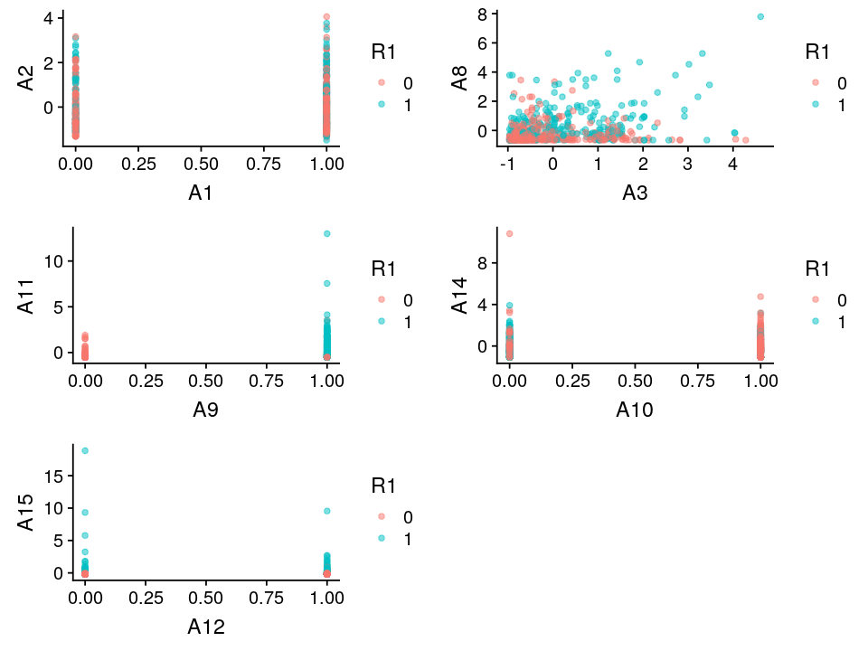
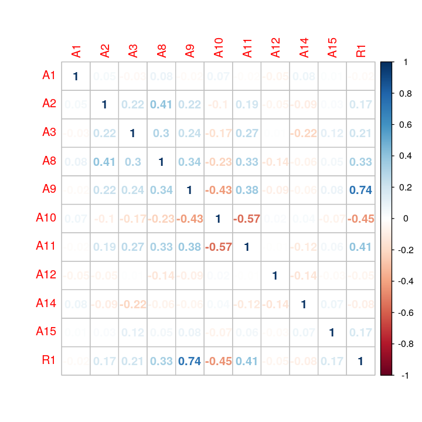
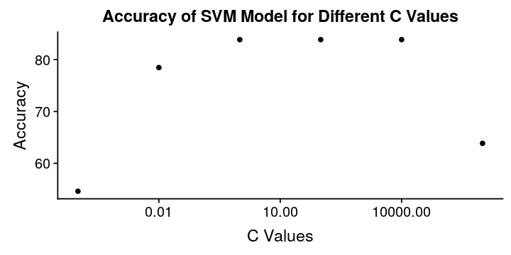
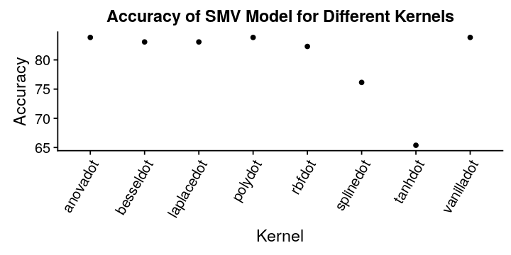
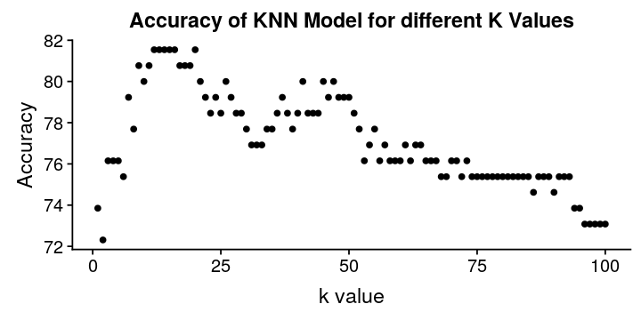

# Predicting Credit Card Application Approvals
---
The dataset comes from the [UCI Machine Learning Repository](https://archive.ics.uci.edu/ml/datasets/Credit+Approval).  It has been cleaned to remove categorical variables and data points with missing values.  [Download Here](credit_card_apps.txt)

## Exploratory Data Analysis

Let's start by just looking at the first few lines of the data.

```R
# Import required packages
library(ggplot2)
suppressMessages(library(kernlab))
library(kknn)
suppressMessages(library(cowplot))
suppressMessages(library(corrplot))
# Import custom function(s)
source('../../functions/split_indices.R')
# Turn off warnings
options(warn=-1)
# Read in the credit data
raw_df = read.table("credit_card_apps.txt", header=TRUE)
# Show the first 3 records of the data
head(raw_df, 3)
```
<table>
<thead><tr><th>A1</th><th>A2</th><th>A3</th><th>A8</th><th>A9</th><th>A10</th><th>A11</th><th>A12</th><th>A14</th><th>A15</th><th>R1</th></tr></thead>
<tbody>
	<tr><td>1    </td><td>30.83</td><td>0.00 </td><td>1.25 </td><td>1    </td><td>0    </td><td>1    </td><td>1    </td><td>202  </td><td>  0  </td><td>1    </td></tr>
	<tr><td>0    </td><td>58.67</td><td>4.46 </td><td>3.04 </td><td>1    </td><td>0    </td><td>6    </td><td>1    </td><td> 43  </td><td>560  </td><td>1    </td></tr>
	<tr><td>0    </td><td>24.50</td><td>0.50 </td><td>1.50 </td><td>1    </td><td>1    </td><td>0    </td><td>1    </td><td>280  </td><td>824  </td><td>1    </td></tr>
</tbody>
</table>

A1 to A15 are the predictors, and R1 is the response that represents whether the credit card application was approved (1) or denied (0).  It should be noted that the UCI repository does not provide any additional information as to what the A## variables represent.

To start, let's scale the data for those variables that are non-binary.  Many of the models have a scale parameter, but I prefer to scale them before providing them to the model.

```R
# Copy the data
credit_df = cbind(raw_df)
# Scale all non-binary variables
credit_df$A2 = as.numeric(scale(credit_df$A2))
credit_df$A3 = as.numeric(scale(credit_df$A3))
credit_df$A8 = as.numeric(scale(credit_df$A8))
credit_df$A11 = as.numeric(scale(credit_df$A11))
credit_df$A14 = as.numeric(scale(credit_df$A14))
credit_df$A15 = as.numeric(scale(credit_df$A15))

head(round(credit_df,2),3)
```
<table>
<thead><tr><th>A1</th><th>A2</th><th>A3</th><th>A8</th><th>A9</th><th>A10</th><th>A11</th><th>A12</th><th>A14</th><th>A15</th><th>R1</th></tr></thead>
<tbody>
	<tr><td>1    </td><td>-0.06</td><td>-0.96</td><td>-0.29</td><td>1    </td><td>0    </td><td>-0.30</td><td>1    </td><td> 0.13</td><td>-0.19</td><td>1    </td></tr>
	<tr><td>0    </td><td> 2.26</td><td>-0.07</td><td> 0.24</td><td>1    </td><td>0    </td><td> 0.71</td><td>1    </td><td>-0.81</td><td>-0.09</td><td>1    </td></tr>
	<tr><td>0    </td><td>-0.59</td><td>-0.86</td><td>-0.22</td><td>1    </td><td>1    </td><td>-0.50</td><td>1    </td><td> 0.59</td><td>-0.04</td><td>1    </td></tr>
</tbody>
</table>

Let's look for any correlations between the predictors and response.  To explore this, we will look at both scatterplots of the predictors and the correlations between the predictors and the response.

```R
# Convert the R1 variables to a factor for graphing
credgg_df = cbind(credit_df)
credgg_df$R1 = as.factor(credgg_df$R1)

# Create the individual scatterplots
a12 = ggplot(credgg_df,aes(x=A1,y=A2,color=R1)) +
    geom_point(alpha=0.5)
a38 = ggplot(credgg_df,aes(x=A3,y=A8,color=R1)) +
    geom_point(alpha=0.5)
a911 = ggplot(credgg_df,aes(x=A9,y=A11,color=R1)) +
    geom_point(alpha=0.5)
a1014 = ggplot(credgg_df,aes(x=A10,y=A14,color=R1)) +
    geom_point(alpha=0.5)
a1215 = ggplot(credgg_df,aes(x=A12,y=A15,color=R1)) +
    geom_point(alpha=0.5)

# Set the image dimensions
options(repr.plot.width=8, repr.plot.height=6)
# Grid the plots together
plot_grid(a12, a38, a911, a1014, a1215, ncol=2)
```


From the scatterplots above, A8, A9, A10, and A15 all appear to correlate with R1.  Let's see their correlation.

```R
# Set the image dimensions
options(repr.plot.width=6, repr.plot.height=6)
corrplot(cor(credit_df), method = "number")
```


In the correlation matrix, we can see that similar to the scatterplot analysis, A8, A9, and A10 all correlate fairly well with R1.  A15 does not appear to correlate very well with R1, as I thought above.

## Splitting the Data

We will split the data into 60% training, 20% validation, and 20% testing sets.  I am using a function that I created to split the data.

```R
# Get the indices for the training, validation, and testing sets
idc = split_indices(nrow(credit_df), 0.6, 0.2, seed=111)
# Set the training, validation, and testing sets
train = credit_df[idc$train,]
valid = credit_df[idc$valid,]
test = credit_df[idc$test,]
# Combine the training and validation sets
trval = credit_df[sort(c(idc$train, idc$valid)),]
```

## Support Vector Machine

Next, let's create our model with a default cost of constraints, C = 1, using the training set.

```R
# Create the support vector machine model
svm_model = ksvm(R1~., train,
              type='C-svc', kernel='vanilladot', C=1, scaled=FALSE)
```

Now that we have the model, let's check out the coefficients of the boundary for the support vector machine model: $$a_{0}, a_{1}, ..., a_{m}$$

```R
# Show a0
a0 = svm_model@b
cat("A0 :", a0)
# Show a1,...,am
a = colSums(svm_model@xmatrix[[1]] * svm_model@coef[[1]])
a
```
<div class="output">
<pre>
A0 : 1.000462
</pre>
</div>
<dl class=dl-horizontal>
	<dt>A1</dt>
		<dd>0.00586443791844937</dd>
	<dt>A2</dt>
		<dd>-0.00366284321922142</dd>
	<dt>A3</dt>
		<dd>0.00260286712479871</dd>
	<dt>A8</dt>
		<dd>0.00503968808330729</dd>
	<dt>A9</dt>
		<dd>2.01144680333765</dd>
	<dt>A10</dt>
		<dd>-0.00997540530228447</dd>
	<dt>A11</dt>
		<dd>0.00241419026502449</dd>
	<dt>A12</dt>
		<dd>0.00760888667767778</dd>
	<dt>A14</dt>
		<dd>-0.00444447508774459</dd>
	<dt>A15</dt>
		<dd>0.106237842704409</dd>
</dl>

In general when all of the predictors are scaled, the larger the coefficient, the more significant an attribute is at predicting the results.  You can see above that A9 carries almost 1000x the weight of most of the other coefficients meaning that it's influence on classifying R1 will carry much more weight than the other predictors.

```R
# Grab the prediction on the testing dataset
pred = predict(svm_model,valid[,1:10])
# Compute the percent correct of the prediction against
# the actual result
cat("Accuracy: ", round(sum(pred == valid[,11]) / nrow(valid) * 100, 2), "%")
```
<div class="output">
<pre>
Accuracy:  83.85 %
</pre>
</div>

We see that when we don't apply any cost to the classification, the accuracy on the validation set is 83.85%.  That is pretty good overall.  Next let's check how different values for C affect the accuracy on the validation set.  We are going to start with a C value of 1,000,000 and divide it by 100 until the C value hits 1/10,000th.  For each C value we will store the accuracy in a data frame for visualizing later.

```R
# Set the starting C value
Cval = 1000000
# Initialize an empty list that can dynamically increase
# as new accuracies are calculated for different C values
accuracies = list()
# Set the starting row for incrementing the list
row = 1
# Loop through the predictions until the C value shrinks below
# the threshold of 0.0001
while(Cval >= 0.0001) {

    # Compute the SVM model based using different C values
    svm_model2 = ksvm(R1~., train, type='C-svc', kernel='vanilladot',
                 C=Cval, scaled=FALSE)
    # Grab the prediction
    pred = predict(svm_model2,valid[,1:10])
    # Compute the percent correct of the prediction against
    # the actual result
    accuracy = round(sum(pred == valid[,11]) / nrow(valid) * 100, 2)
    # Add the C value and the accuracy to the list
    accuracies[[row]] = c(round(Cval,4), accuracy)
    # Increment the row
    row = row + 1
    # Defide the C value by three
    Cval = Cval / 100
}
# Convert the list to a dataframe
accuracies = data.frame(do.call(rbind, accuracies))
# Name the columns of the matrix
colnames(accuracies) = c('C', 'Accuracy')
```

Now that we have the accuracies for different values of C, let's graph the results to see how the accuracy changes as C changes.

```R
# Show the accuracies for each C value
accuracies
```
<table>
<thead><tr><th>C</th><th>Accuracy</th></tr></thead>
<tbody>
	<tr><td>1e+06</td><td>63.85</td></tr>
	<tr><td>1e+04</td><td>83.85</td></tr>
	<tr><td>1e+02</td><td>83.85</td></tr>
	<tr><td>1e+00</td><td>83.85</td></tr>
	<tr><td>1e-02</td><td>78.46</td></tr>
	<tr><td>1e-04</td><td>54.62</td></tr>
</tbody>
</table>

```R
# Plot with Standard notation and not Scientific Notation
options(scipen=5)
options(repr.plot.width=6, repr.plot.height=3)
# Plot the results
qplot(x=C, y=Accuracy, data=accuracies, log='x') +
    xlab('C Values') +
    ylab('Accuracy') +
    ggtitle("Accuracy of SVM Model for Different C Values")
```


We can see that the prediction accuracy stays at the maximum of 83.85% with C values between 10000 and 0.01, but with extremely high or low C values it begins to drop.  This corresponds to the hyperplane boundary shifting too far to one side and miscategorizing more predictions.

Let's try other non-linear kernels available in the ksvm function, and use a consistant C value of 1, because that gave good results above with the linear kernal.

```R
# Create a vector of the kernel names
kernel = c('anovadot', 'besseldot', 'laplacedot', 'polydot', 'rbfdot',
           'splinedot', 'tanhdot', 'vanilladot')
# Initialize a zero accuracy for the kernel names
accuracy = c(0,0,0,0,0,0,0,0)
# Create a data from with kernel names and zero accuracy
kernel_check = data.frame(kernel, accuracy)
# Loop through the kernels and store the accuracy of
# the associated model
for (i in 1:length(kernel)){
    svm_model3 = ksvm(R1~., train,
                  type='C-svc', kernel=kernel[i], C=1, scaled=FALSE)
    # Grab the prediction
    pred = predict(svm_model3,valid[,1:10])

    # Compute the percent correct of the prediction against
    # the actual result
    kernel_check[i, 'accuracy'] = round(sum(pred == valid[,11]) /
                                        nrow(valid) * 100, 2)
}
kernel_check
# Plot the results
qplot(x=kernel, y=accuracy, data=kernel_check) +
  xlab('Kernel') +
  ylab('Accuracy') +
  ggtitle("Accuracy of SMV Model for Different Kernels") +
  theme(axis.text.x=element_text(angle=60, hjust=1))
```
<table>
<thead><tr><th>kernel</th><th>accuracy</th></tr></thead>
<tbody>
	<tr><td>anovadot  </td><td>83.85     </td></tr>
	<tr><td>besseldot </td><td>83.08     </td></tr>
	<tr><td>laplacedot</td><td>83.08     </td></tr>
	<tr><td>polydot   </td><td>83.85     </td></tr>
	<tr><td>rbfdot    </td><td>82.31     </td></tr>
	<tr><td>splinedot </td><td>76.15     </td></tr>
	<tr><td>tanhdot   </td><td>65.38     </td></tr>
	<tr><td>vanilladot</td><td>83.85     </td></tr>
</tbody>
</table>


We can see that none of the higher order projections improved the accuracy. Hence, increasing the complexity of the model via non-linear kernels will not improve performance.

Now that we have identified the optimal parameters, namely a C-value of 1 and the default vanilladot kernel, we are ready to create a K-Nearest Neighbor model using the same training data.

## K-Nearest Neighbor

Similar to the SVM model that we trained above, we will loop through k-values from 1 to 100.  For each k-value we will train the KNN model using the training set and valid date its accuracy on the validation set.  We will use a Minkowski distance of 2, which corresponds to the common Euclidean distance, to measure the closeness between data points.

```R
# Initialize an empty list that can dynamically increase
# as new accuracy are calculated for different C values
accuracies = list()
# Set the parameters
dist = 2
kern = 'rectangular'
# Loop through 100 k-values
for (kval in 1:100){
    # Create the model using the current k value
    knn_model = kknn(R1~., train, valid, k=kval, distance=dist, kernel=kern,
                 scale=FALSE)
    # Grab the prediction for the test set and round the fraction to
    # the closest value
    pred = round(fitted(knn_model))
    # Combine the prediction values and the actual values into a dataframe
    results = data.frame(Actual=valid$R1)
    results['Prediction'] = structure(as.data.frame(pred),
                                       names=c('Prediction'))
    # Calculate the total accuracy of the predictions on the training set
    # for the current k value
    accuracy = round(nrow(subset(results, Prediction == Actual))/
                      nrow(results) * 100, 2)
    # Add the k value and the accuracy to the list
    accuracies[[kval]] = c(kval, accuracy)
}
# Convert the accuracy list to a dataframe
all_data_accuracies = data.frame(do.call(rbind, accuracies))
# Name the columns of the matrix
colnames(all_data_accuracies) = c('k', 'Accuracy')
# Get the best k
kbest = all_data_accuracies[which.max(all_data_accuracies$Accuracy),]$k[1]
# Show the row with the highest accuracy
all_data_accuracies[which.max(all_data_accuracies$Accuracy),]
```
<table>
<thead><tr><th></th><th>k</th><th>Accuracy</th></tr></thead>
<tbody>
	<tr><th>12</th><td>12   </td><td>81.54</td></tr>
</tbody>
</table>

```R
# Show the top three results
head(all_data_accuracies[order(all_data_accuracies$Accuracy,
                          decreasing=TRUE), ], 3)
# Plot the results
qplot(x=k, y=Accuracy, data=all_data_accuracies) +
  xlab('k value') +
  ylab('Accuracy') +
  ggtitle("Accuracy of KNN Model for different K Values")
```
<table>
<thead><tr><th></th><th>k</th><th>Accuracy</th></tr></thead>
<tbody>
	<tr><th>12</th><td>12   </td><td>81.54</td></tr>
	<tr><th>13</th><td>13   </td><td>81.54</td></tr>
	<tr><th>14</th><td>14   </td><td>81.54</td></tr>
</tbody>
</table>


The optimum KNN model uses the 12 nearest neighbors for classification, and it has an accuracy of 81.54% on the validation set.

## Selecting the "best" model

Comparing the optimized support vector machine model and K-nearest neighbors model, we can see that the support vector machine model has a higher accuracy with 83.85%.  Now that we have selected the "best" model, let's see how well it generalizes.

### Does it generalize?

To test the ability of the model to generalize to new data, we will retrain the SVM model using the optimal C-value and kernal on the combined training and validation sets.  The we check its accuracy on the unseen testing set. By keeping the testing set isolated from our previous analysis, we have ensured that the model is in no way influenced by the testing set.  Let's see the results.

```R
# Train the optimized model on the combined training-validation dataset
best_svm_model = ksvm(R1~., trval, type='C-svc', kernel='vanilladot', C=1, scaled=FALSE)

# Grab the testing dataset
pred = predict(best_svm_model,test[,1:10])
# Compute the percent correct of the prediction against
# the actual result
cat("Accuracy: ", round(sum(pred == test[,11]) / nrow(test) * 100, 2), "%")

```
<div class="output">
<pre>
Accuracy:  87.88 %
</pre>
</div>

## Conclusions

With an accuracy of 87.88% on the testing set, we can see that the svm model generalizes quite well.  Surprisingly, the accuracy improved by about 3% as compared to the validation set.
