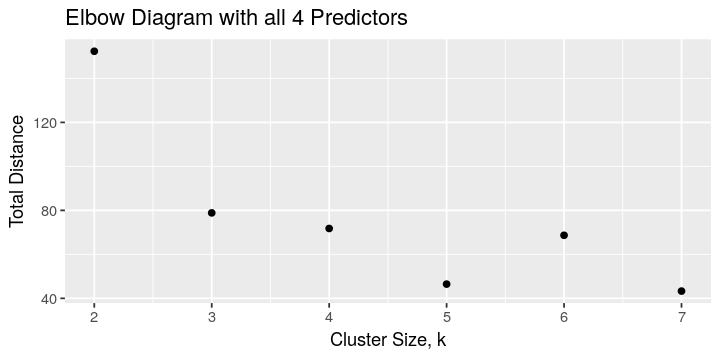
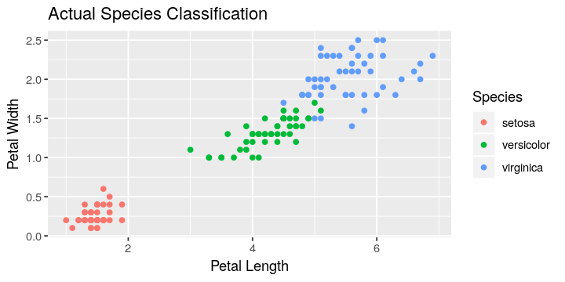
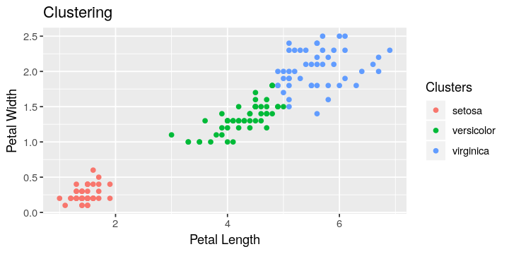
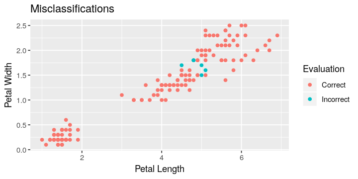

# K-means clustering for flower classification
---

The [IRIS](https://archive.ics.uci.edu/ml/datasets/Iris/) dataset is well known in the machine learning community.  It contains 150 observations on three types of flower petals, each with four features and a classification.

Although k-means clustering is an unsupervised learning algorithm, we will use it to classify flower types in the IRIS dataset.

```R
# Import required packages
library(ggplot2)
library(gtools)
# Hide the warning message because both ggplot2 and kernlab
# have functions called alpha
library(kernlab, warn.conflicts = FALSE)
# Import the IRIS data into a matrix
iris_data = read.csv("iris.csv", header=TRUE)
# Strip the Num and Species column from the IRIS data
iris_km = iris_data[ , 2:5]
# Show the first 4 lines of the data
head(iris_km, 4)
```

<table>
<thead><tr><th>Sepal.Length</th><th>Sepal.Width</th><th>Petal.Length</th><th>Petal.Width</th></tr></thead>
<tbody>
	<tr><td>5.1</td><td>3.5</td><td>1.4</td><td>0.2</td></tr>
	<tr><td>4.9</td><td>3.0</td><td>1.4</td><td>0.2</td></tr>
	<tr><td>4.7</td><td>3.2</td><td>1.3</td><td>0.2</td></tr>
	<tr><td>4.6</td><td>3.1</td><td>1.5</td><td>0.2</td></tr>
</tbody>
</table>

We see 4 predictors, namely, Sepal Length, Sepal Width, Petal Length and Petal Width.

Since we want to find the best predictors, let's begin by identifying all possible combinations of predictors.  This will help us with optimizing our model by determining which combination of predictors is best overall.

```R
# Get the column names of the set without the last column
predictors = names(iris_km)
cat("All Predictors:\n", predictors, "\n\n")
# Create a list to store the predictor
# combinations
predictor_combos = list()
row = 1
# Loop through all possible combination sizes
# from the predictors
for (combo_size in 2:length(predictors)) {
    # Grab all possible combinations for the current
    # combination size
    all_combinations = combn(length(predictors), combo_size)
    # Loop through all the combinations
    for (j in seq(from=1, to=length(all_combinations), by=combo_size)){
        # Get the indices of the combinations
        current_combo_ind = all_combinations[j:(j+combo_size-1)]
        # Get the current combination of predictor names
        current_combo = predictors[current_combo_ind]
        # Add the current predictor combination to the list
        predictor_combos[[row]] = predictors[current_combo_ind]
        # Increment the list
        row = row + 1
    }
}
# Show all predictor combinations
cat("All Predictor Combinations: ")
predictor_combos
```
<div class="output">
<pre>
All Predictors:
 Sepal.Length Sepal.Width Petal.Length Petal.Width

All Predictor Combinations:

'Sepal.Length', 'Sepal.Width'
'Sepal.Length', 'Petal.Length'
'Sepal.Length', 'Petal.Width'
'Sepal.Width', 'Petal.Length'
'Sepal.Width', 'Petal.Width'
'Petal.Length', 'Petal.Width'
'Sepal.Length', 'Sepal.Width', 'Petal.Length'
'Sepal.Length', 'Sepal.Width', 'Petal.Width'
'Sepal.Length', 'Petal.Length', 'Petal.Width'
'Sepal.Width', 'Petal.Length', 'Petal.Width'
'Sepal.Length', 'Sepal.Width', 'Petal.Length', 'Petal.Width'
</pre>
</div>

You can see with four predictors, we have 11 combinations with at least two predictors for k-means clustering.  Let's start to train our model using k-means clustering while adjusting k and the predictor combinations to determine which k value and predictor combination is best overall.  

The "best" k value occurs at the elbow of the of the curve in the plot of total distance against cluster size.  This occurs when the point is at the maximum distance from the line that connects the first and last points in the graph, as shown [here](https://stackoverflow.com/questions/2018178/finding-the-best-trade-off-point-on-a-curve/2022348#2022348).

Let ___ls___ and ___le___ be points on a line.  The closest distance from the point ___p___ to the line is defined as:

$$d = abs(\frac{det\left\lgroup \matrix{\vec{le} - \vec{ls} \cr \vec{ls} - \vec{p}} \right\rgroup }{ \vec{le} - \vec{ls}})$$

Let's determine the best cluster size for each predictor combination by finding the point with the maximum distance to the line for each predictor set.  Then, let's find the cluser size the occurs the most often to determine which cluster size is best.

```R
# Fuction dist_to_line: Calculates the closest distance from point
# to the line defined by the points line_start and line_end
# Notes: This function only works when the input vectors are 2D
# Variables:
#    point - The point to calculate the distance from
#    line_start - The first point on the line
#    line_end - The second point on the line
# Returns: Distance from the point to the line
dist_to_line = function(point, line_start, line_end) {
    line1 = line_end - line_start
    line2 = line_start - point
    matrix = cbind(line1, line2)
    distance = abs(det(matrix))/sqrt(sum(line1 * line1))
    return(distance)
}
```

```R
set.seed(125)
# Set the graph dimensions
options(repr.plot.width=6, repr.plot.height=3)
bestks = list()
row = 1
# Loop through our predictor combinations
for (j in 1:length(predictor_combos)){
    # Initialize the list that will store the cluster sizes
    # the corresponding distances to the line defined by the
    # first and last points in the k value elbow diagram
    k_dist = list()
    # Initialize our incrementor for our k_dist list
    krow = 1
    # Loop through our cluster sizes
    for (k in 2:7){  
        # Train our model using different cluster sizes
        km_model = kmeans(iris_km[, predictor_combos[[j]]], k)
        # Store the cluster size, k, and the total distance
        # of the points to the center of their cluster
        k_dist[[krow]] = c(k, km_model$tot.withinss)
        krow = krow + 1
    }

    # Convert the list to a dataframe
    k_dist = data.frame(do.call(rbind, k_dist))
    # Name the columns of the dataframe
    colnames(k_dist) = c('k', 'Total.Distance')
    # Determine the best cluster size by finding the maximum
    # distance from the (k, Total.Distance) points to the line
    # between the first point and the last point
    # Get the first point in the line
    line_start = c(k_dist[1, 1], k_dist[1, 2])
    # Get the second point in the line
    line_end = c(k_dist[nrow(k_dist), 1], k_dist[nrow(k_dist), 2])
    # Reset the maximum distance
    dmax = 0
    # Looop through the cluster sizes not including
    # the first or last cluster size
    for(i in 2:(nrow(k_dist)-1)){
        # Get the point to compute the distance
        point = c(k_dist[i,1], k_dist[i,2])
        # Get the distance from the current point to
        # the line defined by the first and last points
        # in the total distance vs cluster size elbow diagram
        distance = dist_to_line(point, line_start, line_end)
        # Add/Replace the cluster size within the list of best cluster
        # sizes for the current predictor combination
        if (distance > dmax) {
            dmax = distance
            bestks[[row]] = c(k_dist[i,1],
                               paste(predictor_combos[[j]],collapse=", "))
        }
    }
    # Increment our best cluster sizes list
    row = row + 1
}
# Convert the list to a dataframe
bestks = data.frame(do.call(rbind, bestks))
# Name the columns of the matrix
colnames(bestks) = c('k', 'Predictors')
# Get the k value the occurs the most often
kbest = as.numeric(names(which.max(table(bestks$k))))
# Show the best cluster size for each predictor combination
bestks
cat("Best cluster size (k):", kbest)
```
<table>
<thead><tr><th>k</th><th>Predictors</th></tr></thead>
<tbody>
	<tr><td>3                                                   </td><td>Sepal.Length, Sepal.Width                           </td></tr>
	<tr><td>4                                                   </td><td>Sepal.Length, Petal.Length                          </td></tr>
	<tr><td>3                                                   </td><td>Sepal.Length, Petal.Width                           </td></tr>
	<tr><td>3                                                   </td><td>Sepal.Width, Petal.Length                           </td></tr>
	<tr><td>3                                                   </td><td>Sepal.Width, Petal.Width                            </td></tr>
	<tr><td>3                                                   </td><td>Petal.Length, Petal.Width                           </td></tr>
	<tr><td>3                                                   </td><td>Sepal.Length, Sepal.Width, Petal.Length             </td></tr>
	<tr><td>3                                                   </td><td>Sepal.Length, Sepal.Width, Petal.Width              </td></tr>
	<tr><td>3                                                   </td><td>Sepal.Length, Petal.Length, Petal.Width             </td></tr>
	<tr><td>3                                                   </td><td>Sepal.Width, Petal.Length, Petal.Width              </td></tr>
	<tr><td>3                                                   </td><td>Sepal.Length, Sepal.Width, Petal.Length, Petal.Width</td></tr>
</tbody>
</table>
<div class="output">
<pre>
Best cluster size (k): 3
</pre>
</div>

```R
# Show one of the elbow diagrams
qplot(x=k, y=Total.Distance, data=k_dist) +
  xlab('Cluster Size, k') +
  ylab('Total Distance') +
  ggtitle("Elbow Diagram with all 4 Predictors")
```



It is clear from the table above that across nearly all combinations of predictors, a cluster size of 3 is the best.  Since our data is labeled with the species name, let's check to see how many unique species there are, and if, in fact, there are 3 species just like our models clustered the data.

```R
# Get the unique species names from the IRIS data
all_species = as.vector(unique(iris_data$Species))
all_species
```
<div class="output">
<pre>
'setosa' 'versicolor' 'virginica'
</pre>
</div>

We can see that there are indeed distinct 3 species within the data set.  Great! Our clustering size is promising.  Now we need to determine which predictor combinations are the best for clustering the data.  We want to generate a model using each of the 11 predictor combinations and then calculate the accuracy of the model against the actual classification of the flower type.

There is one catch, though.  How do we know how to map the cluster number to the correct species?  In truth, we don't because the model randomizes the starting points for the cluster centers.  What can we do?

We can generate a map the will link all possible combinations of the cluster numbers to the three species.  Luckily, there are only six possible combinations, so brute forcing the most likely combination should be fairly quick by selecting the mapping that produces the highest accuracy.

|Cluster Groups|Species|
|-------------:|-------|
|1,2,3|setosa,versicolor,virginica|
|1,3,2|setosa,virginica,versicolor|
|2,1,3|versicolor,setosa,verginica|
|2,3,1|versicolor,verginica,setosa|
|3,1,2|verginica,setosa,versicolor|
|3,2,1|verginica,versicolor,setosa|

The `gtools` library has an excellent `permutations()` function that we can use to grab all of the non-repeating permutations of the three species types.  Now we have a way to map cluster number to species.

```R
species_perm = permutations(n=3,r=3,v=all_species,repeats.allowed=F)
species_perm
```

<table>
<tbody>
	<tr><td>setosa    </td><td>versicolor</td><td>virginica </td></tr>
	<tr><td>setosa    </td><td>virginica </td><td>versicolor</td></tr>
	<tr><td>versicolor</td><td>setosa    </td><td>virginica </td></tr>
	<tr><td>versicolor</td><td>virginica </td><td>setosa    </td></tr>
	<tr><td>virginica </td><td>setosa    </td><td>versicolor</td></tr>
	<tr><td>virginica </td><td>versicolor</td><td>setosa    </td></tr>
</tbody>
</table>

Let's check which combination of predictors is the best at clustering the flower data into unique species.  To find the best combination we will loop through our 11 unique predictor combinations and generate the model using the 3 cluster k value we found earlier.

There is one other issue we should consider as well.  As I discussed with problem 3.1 the seed that we select can influence the accuracy of the model.  To help dampen this influence, we are going to loop through 200 seed values, generate the model for each of the 11 permutations, and calculate the average accuracy of each model using all 200 seed values.

```R
# Initialize our list of accuracies
accuracies = list()
# Inialize our accuracy list incrementor
row = 1
# Initialize our maximum seed value to 200
max_seed = 200
# Loop through our predictor combinations
for (i in 1:length(predictor_combos)){
    # Initialize the sum of the accuracies for the
    # current predictor combination
    sum_accuracy = 0.0
    for(seed_val in 1:max_seed){  
        # Set the seed value for randomization
        set.seed(seed_val)  
        # Get our model using the current predictor combinations
        # and the best cluster number
        km_model = kmeans(iris_km[, predictor_combos[[i]]], kbest)
        # Initialize a maximum accuracy placeholder
        # To find how the cluster numbers map to the
        # species type
        max_accuracy = 0.0
        # Loop through the possible permutations of the species
        # order to map the cluster number to the species
        for (j in 1:nrow(species_perm)){
            # Get the predictions
            predictions = species_perm[j, km_model$cluster]
            # Get the actual species classification
            actual = as.vector(iris_data$Species)
            # Compute the accuracy
            accuracy = sum(predictions == actual) / length(actual) * 100
            cur_combo = paste(predictor_combos[[i]],collapse=", ")
            cur_species_map = paste(species_perm[j, ])
            if(accuracy > max_accuracy){
                max_accuracy = accuracy
            }
        }
        sum_accuracy = sum_accuracy + max_accuracy
    }
    avg_accuracy = round(sum_accuracy / max_seed, 2)
    accuracies[[row]] = c(cur_combo, avg_accuracy)
    row = row + 1
}
# Convert the list to a dataframe
accuracies = data.frame(do.call(rbind, accuracies))
# Name the columns of the matrix
colnames(accuracies) = c('Predictor.Combo', 'Accuracy')
# Show the overall accuracies
accuracies
```

<table>
<thead><tr><th>Predictor.Combo</th><th>Accuracy</th></tr></thead>
<tbody>
	<tr><td>Sepal.Length, Sepal.Width                           </td><td>81.86                                               </td></tr>
	<tr><td>Sepal.Length, Petal.Length                          </td><td>82.63                                               </td></tr>
	<tr><td>Sepal.Length, Petal.Width                           </td><td>82.59                                               </td></tr>
	<tr><td>Sepal.Width, Petal.Length                           </td><td>84.32                                               </td></tr>
	<tr><td>Sepal.Width, Petal.Width                            </td><td>86.38                                               </td></tr>
	<tr><td>Petal.Length, Petal.Width                           </td><td>95.38                                               </td></tr>
	<tr><td>Sepal.Length, Sepal.Width, Petal.Length             </td><td>81.56                                               </td></tr>
	<tr><td>Sepal.Length, Sepal.Width, Petal.Width              </td><td>82.67                                               </td></tr>
	<tr><td>Sepal.Length, Petal.Length, Petal.Width             </td><td>89.33                                               </td></tr>
	<tr><td>Sepal.Width, Petal.Length, Petal.Width              </td><td>86.03                                               </td></tr>
	<tr><td>Sepal.Length, Sepal.Width, Petal.Length, Petal.Width</td><td>83.22                                               </td></tr>
</tbody>
</table>

We can see above that the best predictors for clustering are **Petal Length** and **Petal Width** with an average accuracy of **95.4%**.  All other combinations have average accuracies under 90%.

Let's cluster our data using these optimal parameters and graph both the clusters and the actual species to see the differences and similarities.

```R
# Set the seed value for randomization
set.seed(200)
# Get our model using the current predictor combinations
# and the best cluster number
km_model = kmeans(iris_km[, c('Petal.Length', 'Petal.Width')], kbest)
# Initialize a maximum accuracy placeholder
# To find how the cluster numbers map to the
# species type
max_accuracy = 0.0
# Loop through the possible permutations of the species
# order to map the cluster number to the species
for (j in 1:nrow(species_perm)){
    # Get the predictions
    predictions = species_perm[j, km_model$cluster]
    # Get the actual species classification
    actual = as.vector(iris_data$Species)
    # Compute the accuracy
    accuracy = sum(predictions == actual) / length(actual) * 100
    cur_combo = paste(predictor_combos[[i]],collapse=", ")
    cur_species_map = paste(species_perm[j, ])
    # If the current accuracy is better than the
    # maximum accuracy then set our maximum accuracy
    # to the current accuracy and set our best predictions
    # to the current set of predictions
    if(accuracy > max_accuracy){
        max_accuracy = accuracy
        best_predictions = predictions
    }
}
# Show the actual classification
qplot(x=Petal.Length, y=Petal.Width, data=iris_data, color=Species) +
  xlab('Petal Length') +
  ylab('Petal Width') +
  ggtitle("Actual Species Classification")
```



```R
# Set the clusters data
iris_data$Clusters = best_predictions

# Show the clustering results
qplot(x=Petal.Length, y=Petal.Width, data=iris_data, color=Clusters) +
  xlab('Petal Length') +
  ylab('Petal Width') +
  ggtitle("Clustering")
```



```R
# Set the data point prediction as Good or Bad depending on if it
# was classified correctly
iris_data$Evaluation = ifelse(iris_data$Clusters == iris_data$Species,
                               "Correct", "Incorrect")
# Calculate the accuracy of the model
accuracy =sum(iris_data$Evaluation == "Correct")/nrow(iris_data) * 100
# Show the accuracy
cat("Clustering Model Accuracy: ", accuracy)
# Show the misclassifications of the clustering results
qplot(x=Petal.Length, y=Petal.Width, data=iris_data, color=Evaluation) +
  xlab('Petal Length') +
  ylab('Petal Width') +
  ggtitle("Misclassifications")
```
<div class="output">
<pre>
Clustering Model Accuracy:  96
</pre>
</div>



Not bad!  Here are the results of our optimizations:

|Best Combination of Predictors|Suggested value of k|Accuracy of the K-Means Model|
|------------------------------|--------------------|-----------------------------|
|Petal.Width with Petal.Length |3                   |96%                          |

In the graphs you can see the overlap between Petal Length/Petal Height for versicolor and virginica, which causes the clustering to misclassify the species.
