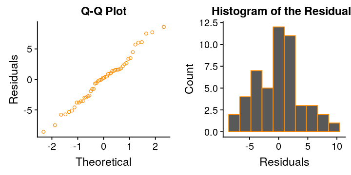

# Estimating U.S. examination results from spending per student
---

This dataset comes from Kaggle's [U.S. Education Datasets: Unification Project](https://www.kaggle.com/noriuk/us-education-datasets-unification-project).  I have already preprocessed the dataset to select the average scores and average spending per student.  [Download it here](states2015.csv).  You can follow that process in my exploratory analysis:

[Is there a relationship between U.S. state spending per student and examination results?](/eda/us_state_education/)

## Setting Up

```R
# Import the libraries
suppressMessages(library(dplyr))
suppressMessages(library(car))
suppressMessages(library(GGally))
suppressMessages(library(cowplot))
suppressMessages(library(MASS))

# Import the data
df_2015 = read.csv('states2015.csv', header=TRUE)
# Show the data frame
cat('Total Rows:', nrow(df_2015))
head(df_2015,3)
```
<div class="output">
<pre>
Total Rows: 50
</pre>
</div>

<table>
<thead><tr><th scope=col>STATE</th><th scope=col>ENROLL</th><th scope=col>TOTAL_EXPENDITURE</th><th scope=col>AVG_SCORE</th><th scope=col>STUDENT_EXP</th></tr></thead>
<tbody>
	<tr><td>ALABAMA  </td><td>734974   </td><td>7501799  </td><td>245.9005 </td><td>10.206890</td></tr>
	<tr><td>ALASKA   </td><td>130755   </td><td>2968341  </td><td>247.0921 </td><td>22.701549</td></tr>
	<tr><td>ARIZONA  </td><td>944978   </td><td>7902600  </td><td>249.0399 </td><td> 8.362734</td></tr>
</tbody>
</table>

Now that we have the data available, Let's look at a scatterplot of the data points and the corresponding simple linear regression line.

### Scatterplot of Score vs Spending

```R
# Create the linear regression model
model = lm(AVG_SCORE ~ STUDENT_EXP, df_2015)
# Get the coefficients
x0 = model$coeff[[1]]
x1 = model$coeff[[2]]
# Create the scatterplot of score vs expenditure
# with the regression line
options(repr.plot.width=6, repr.plot.height=4)
ggplot(df_2015,aes(x=STUDENT_EXP,y=AVG_SCORE)) +
    geom_point(alpha=0.5) +
    geom_abline(intercept = x0, slope = x1, color='darkorange') +
    xlab('Avg Spending per Student (x $1000)') +
    ylab('Avg Score') +
    ggtitle('Score vs Spending')
```


The regression line trends fairly well with the data points, and it does appear to be a linear relationship.

## Reviewing the simple linear regression model

```R
summary(model)
```

<div class="output">
<pre>
Call:
lm(formula = AVG_SCORE ~ STUDENT_EXP, data = df_2015)

Residuals:
    Min      1Q  Median      3Q     Max
-8.5742 -2.8968  0.2726  1.7751  8.5980

Coefficients:
            Estimate Std. Error t value Pr(>|t|)    
(Intercept) 247.6250     1.9463 127.228   <2e-16 ***
STUDENT_EXP   0.3542     0.1360   2.604   0.0122 *  
---
Signif. codes:  0 ‘ *** ’ 0.001 ‘ ** ’ 0.01 ‘ * ’ 0.05 ‘.’ 0.1 ‘ ’ 1

Residual standard error: 3.942 on 48 degrees of freedom
Multiple R-squared:  0.1237,	Adjusted R-squared:  0.1055
F-statistic: 6.779 on 1 and 48 DF,  p-value: 0.01224
</pre>
</div>

$$AVG\_SCORE = 247.6250 + 0.3542\ STUDENT\_EXP$$

Both the intercept and the average spending per student are significant, with p-values below the accepted $\alpha$ = 0.05 threshold.

From the model, for every additional \$1000 spent per student, the average student score will increase by 0.35 points.

Another way to state it is that for a 1 point increase in average score, the state needs to spend an additional \$2,823 per student.

We also see that the $R^2$ value is only 0.1237, suggesting that there are other factors that explain score than simply the average spending per student.

## Evaluating the fit of the model

To evaluate the fit of the model, we need to check the model's assumptions, namely:

* Linearity / Mean Zero Assumption $E(\epsilon_i) = 0$
* Constant Variance Assumption $Var(\epsilon_i) = \sigma^2$
* Normality Assumption $\epsilon \sim N(0,\sigma^2)$
* Independence Assumption $\epsilon_i,...,\epsilon_n$ are independent

### Linearity / Mean Zero Assumption $E(\epsilon_i) = 0$
To assess the linearity / mean zero assumption we will look at the scatter plot of the residuals against the average total spending per student.

```R
# Create an analysis data frame
analysis = df_2015
# Append the residuals and fitted values to the data
analysis$residuals = model$residuals
analysis$fitted = model$fitted
# Set the image dimensions
options(repr.plot.width=6, repr.plot.height=3)
# Create a scatter plot of the residuals against spending
ggplot(analysis, aes(x=STUDENT_EXP, y=residuals)) +
    geom_point(shape=1, color='orange2') +
    geom_abline(intercept = 0, slope = 0) +
    xlab('Avg. Tot. Spending per Student') +
    ylab('Residuals')
```


The linearity/mean zero assumption appears to hold.  There is no clear curvature to the residuals that may indicate a non-linear relationship.

### Constant Variance Assumption $Var(\epsilon_i) = \sigma^2$

To assess the constant variance assumption we will look at the scatterplots of the residuals against the fitted values.  We are looking for [homoskedasticity](https://en.wikipedia.org/wiki/Homoscedasticity).

```R
# Set the image dimensions
options(repr.plot.width=6, repr.plot.height=3)
# Residual Plot
ggplot(analysis, aes(x=fitted, y=residuals)) +
geom_point(shape=1, color='red3') +
    geom_abline(intercept = 0, slope = 0) +
    xlab('Fitted Values') +
    ylab('Residuals') +
    ggtitle("Residual Plot")
```


There may be a slight increase in variance as the fitted values increase.  However, with only 50 data points in this set, it is difficult to conclude from the figure above.

Fortunately, we can test it algorithmically with the **Non-Constant Variance (NVC) Test** from the `cars` package.

```R
ncvTest(model)
```

<div class="output">
<pre>
Non-constant Variance Score Test
Variance formula: ~ fitted.values
Chisquare = 1.056671, Df = 1, p = 0.30398
</pre>
</div>

With a p-value of 0.30, we do not reject the null hypothesis and can reasonably conclude that the data have constant variance.

### Normality Assumption $\epsilon \sim N(0,\sigma^2)$

To assess the normality assumption we will look at the QQ plot of the residuals and the histogram of the residuals.

```R
# Set the image dimensions
options(repr.plot.width=6, repr.plot.height=3)
# Normal Q-Q Plot
plt_qq = ggplot(analysis, aes(sample=residuals)) +
    stat_qq(shape=1, color='darkorange') +
    xlab('Theoretical') +
    ylab('Residuals') +
    ggtitle("Q-Q Plot")
# Histogram of Residuals
plt_hst = ggplot(analysis, aes(residuals)) +
    geom_histogram(bins=10, color='darkorange') +
    xlab('Residuals') +
    ylab('Count') +
    ggtitle("Histogram of the Residuals")
# Grid them together
plot_grid(plt_qq, plt_hst, ncol=2)
```



The Q-Q plot suggests that the residuals follow a normal distribution without significant positive or negative tails.  However, the histogram of residuals does not appear to be normally distributed.  Let's run the Shapiro-Wilk test on the residuals to see if they are normally distributed.

```R
# Run the Shapiro Test
sw_results <- shapiro.test(analysis$residuals)
cat('Shapiro-Wilk p-value:', sw_results$p.value)
```
<div class="output">
<pre>
Shapiro-Wilk p-value: 0.7254706
</pre>
</div>

With a p-value of 0.72, we do not reject the null hypothesis and can reasonably conclude that the residuals are normally distributed.

### Independence Assumption $\epsilon_i,...,\epsilon_n$ are independent

We are only using a single predictor, the total average spending per student, to estimate the average student scores.  Therefore, we do not need to check for multicollinearity between predictors and we can reasonably assume that the residuals are independent.

Given that the model has passed all of the assumption tests, we can conclude that it is a good fit for the data.

## Improving the model

Can we improve the model in any way? One avenue to check is if either of the variables should be transformed to more closely fit a normal distribution. Let's test for normality on both variables.

```R
# Run the Shapiro Test on AVG_SCORE
sw_results <- shapiro.test(analysis$AVG_SCORE)
cat('AVG_SCORE Shapiro-Wilk p-value:', sw_results$p.value)
# Run the Shapiro Test on STUDENT_EXP
sw_results <- shapiro.test(analysis$STUDENT_EXP)
cat('\nSTUDENT_EXP Shapiro-Wilk p-value:', sw_results$p.value)
```
<div class="output">
<pre>
AVG_SCORE Shapiro-Wilk p-value: 0.7114576
STUDENT_EXP Shapiro-Wilk p-value: 0.002277738
</pre>
</div>

We can reasonably conclude that AVG_SCORE follows a normal distribution, but STUDENT_EXP do not.  Let's try to transform the STUDENT_EXP variable.

### Box-Cox Transformation

We could perform a Box-Cox transformation to identify the "best" lambda value.

```R
# Create a Box-Cox transformation
bxcx <- boxcox(lm(analysis$STUDENT_EXP~1))
# Get the index of the minimum value for the log-likelihood
idx = which.max(bxcx$y)
# Get the corresponding lambda value
lam_best = bxcx$x[idx]
# Print the best lambda
cat('The "best" lambda value for the box cox transformation is:', lam_best)
```
<div class="output">
<pre>
The "best" lambda value for the box cox transformation is: -0.5050505
</pre>
</div>


Let's transform the STUDENT_EXP data by raising it to -0.5.

```R
# Copy the original data
df_trans = df_2015
# Transform STUDENT_EXP
df_trans$STUD_TRANS = df_trans$STUDENT_EXP ^ -0.5
# Run the Shapiro Test on STUDENT_EXP
sw_results <- shapiro.test(df_trans$STUD_TRANS)
cat('STUDENT_EXP^-0.5 Shapiro-Wilk p-value:', sw_results$p.value)
```

<div class="output">
<pre>
STUDENT_EXP^-0.5 Shapiro-Wilk p-value: 0.7618337
</pre>
</div>

We can reasonably conclude that STUDENT_EXP<sup>-0.5</sup> follows a normal distribution.  Let's compare the histogram of the original predictor and the transformed predictor.

```R
# Histogram of Residuals
plt_hist = ggplot(data=df_trans, aes(STUDENT_EXP)) +
    geom_histogram(bins=12, color='orange2') +
    xlab('Avg Student Spending') +
    ylab('Count')
plt_trns = ggplot(data=df_trans, aes(STUD_TRANS)) +
    geom_histogram(bins=12, color='red2') +
    xlab('Avg Student Spending ^ -0.5') +
    ylab('Count')
# Set the image dimensions
options(repr.plot.width=8, repr.plot.height=3)
# Grid the plots together
plot_grid(plt_hist, plt_trns, ncol=2)
```


The original predictor data was right skewed, and we can see that the transformed data follows more of a normal distribution.  Let's look at a scatterplot of the transformed data and the corresponding linear regression model.

### Scatterplot of Score vs Inverse Square of Spending

```R
# Create the linear regression model
model2 = lm(formula = AVG_SCORE ~ STUD_TRANS, df_trans)
# Get the coefficients
x02 = model2$coeff[[1]]
x12 = model2$coeff[[2]]
# Create the scatterplot of score vs expenditure
# with the regression line
options(repr.plot.width=6, repr.plot.height=4)
ggplot(df_trans,aes(x=STUD_TRANS,y=AVG_SCORE)) +
    geom_point(alpha=0.5) +
    geom_abline(intercept = x02, slope = x12, color='red2') +
    xlab('Inverse Square of Student Spending') +
    ylab('Avg Score') +
    ggtitle('Score vs Inverse Square of Spending')
```


Using the inverse square of the average student spending has swapped the linear trend of the data points from positive to negative.  This makes sense because the larger the original value, the smaller it will be after transforming it.

## Reviewing the transformed simple linear regression model

```R
summary(model2)
```

<div class="output">
<pre>
Call:
lm(formula = AVG_SCORE ~ STUD_TRANS, data = df_trans)

Residuals:
    Min      1Q  Median      3Q     Max
-8.1239 -2.9106  0.3857  2.1013  8.4650

Coefficients:
            Estimate Std. Error t value Pr(>|t|)    
(Intercept)  263.590      4.032  65.377  < 2e-16 ***
STUD_TRANS   -39.897     14.343  -2.782  0.00771 **
---
Signif. codes:  0 ‘ *** ’ 0.001 ‘ ** ’ 0.01 ‘ * ’ 0.05 ‘.’ 0.1 ‘ ’ 1

Residual standard error: 3.908 on 48 degrees of freedom
Multiple R-squared:  0.1388,	Adjusted R-squared:  0.1209
F-statistic: 7.738 on 1 and 48 DF,  p-value: 0.007706
</pre>
</div>

$$AVG\_SCORE = 263.590 - 39.897\ STUDENT\_EXP^{-0.5}$$

Both the intercept and the inverse squared of the average spending per student are significant, with p-values below the accepted $\alpha$ = 0.05 threshold.

From the model, a one unit increase in the inverse square of the average student spending, the average student score will decrease by 39.897 points.  Interpreting this in terms of the original student spending is very difficult since it is no longer a linear relationship.

The $R^2$ value has improved slightly from 0.1237 to 0.1388.  Since the model is using the inverse of the square of average student spending, the coefficient has shifted from positive to negative.  Let's check the fit of this new model.

## Evaluating the fit of the transformed model

### Linearity / Mean Zero Assumption $E(\epsilon_i) = 0$

```R
# Create an analysis data frame
analysis2 = df_trans
# Append the residuals and fitted values to the data
analysis2$residuals = model2$residuals
analysis2$fitted = model2$fitted
# Set the image dimensions
options(repr.plot.width=6, repr.plot.height=3)
# Create a scatter plot of the residuals against spending
ggplot(analysis2, aes(x=STUD_TRANS, y=residuals)) +
    geom_point(shape=1, color='red2') +
    geom_abline(intercept = 0, slope = 0) +
    xlab('Inverse Square of Student Spending') +
    ylab('Residuals')
```


The residuals appear to have constant variance.  Let's run the NVC Test on it to check algorithmically.

```R
ncvTest(model2)
```

<div class="output">
<pre>
Non-constant Variance Score Test
Variance formula: ~ fitted.values
Chisquare = 0.7138748, Df = 1, p = 0.39816
</pre>
</div>

The model passes the NVC Test and we can reasonably conclude that the transformed residuals are normally distributed.  You can also see that the p value increased from 0.30 to 0.40, a 10% increase.

### Normality Assumption $\epsilon \sim N(0,\sigma^2)$

```R
# Set the image dimensions
options(repr.plot.width=6, repr.plot.height=3)
# Normal Q-Q Plot
plt_qq = ggplot(analysis2, aes(sample=residuals)) +
    stat_qq(shape=1, color='red2') +
    xlab('Theoretical') +
    ylab('Residuals') +
    ggtitle("Q-Q Plot")
# Histogram of Residuals
plt_hst = ggplot(analysis2, aes(residuals)) +
    geom_histogram(bins=10, color='red2') +
    xlab('Residuals') +
    ylab('Count') +
    ggtitle("Histogram of the Residuals")
# Grid them together
plot_grid(plt_qq, plt_hst, ncol=2)
```


Both the Q-Q plot and the histogram, which match the original model closely, suggest that the residuals follow a normal distribution without significant positive or negative tails.  Let's run the Shapiro-Wilk test on the residuals to see if they are normally distributed.

```R
# Run the Shapiro Test
sw_results <- shapiro.test(analysis2$residuals)
cat('Shapiro-Wilk p-value:', sw_results$p.value)
```

<div class="output">
<pre>
Shapiro-Wilk p-value: 0.6382408
</pre>
</div>

Although the p-value has decreased by 0.09 relative to the original model, we can still conclude that the residuals are normally distributed.

### Independence Assumption $\epsilon_i,...,\epsilon_n$ are independent

We are only using a single predictor, the total average spending per student, to estimate the average student scores.  Therefore, we do not need to check for multicollinearity between predictors and we can reasonably assume that the residuals are independent.

Given that the model has passed all of the assumption tests, we can conclude that it is a good fit for the data.

## Conclusions

We have seen that average student scores by state trend linearly with the average spending per student.  Although the model has a low $R^2$ value, it passes all of the assumptions and we can reasonably conclude that it is a good fit for the data.  Transforming the data using an inverse square of the average student spending increases the $R^2$ and also is a good fit for the data.

### Which model is "better"?

The short answer is, it depends.  However, given the limited improvement in the $R^2$ value of the transformed model, I would argue to use the original model.  It is much easier to interpret and is still a good fit for the data.
