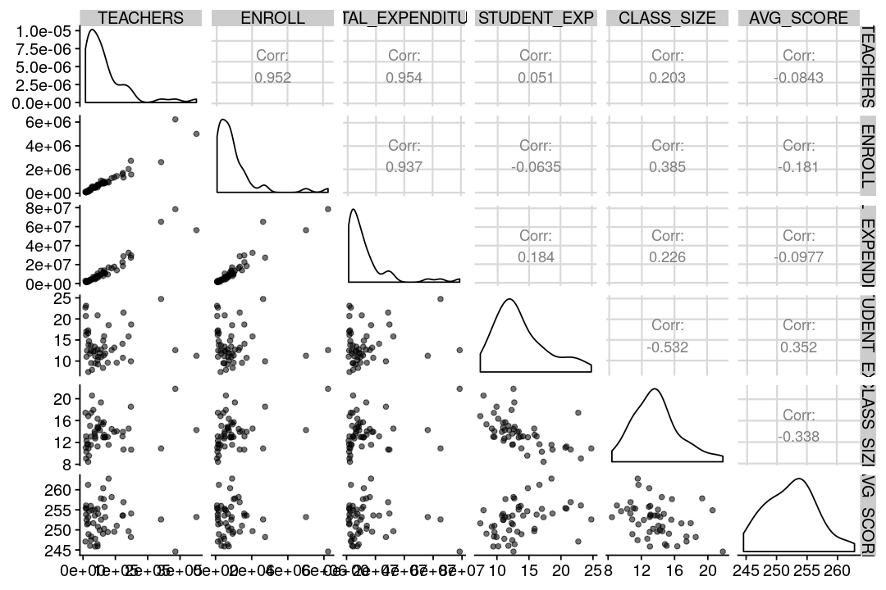
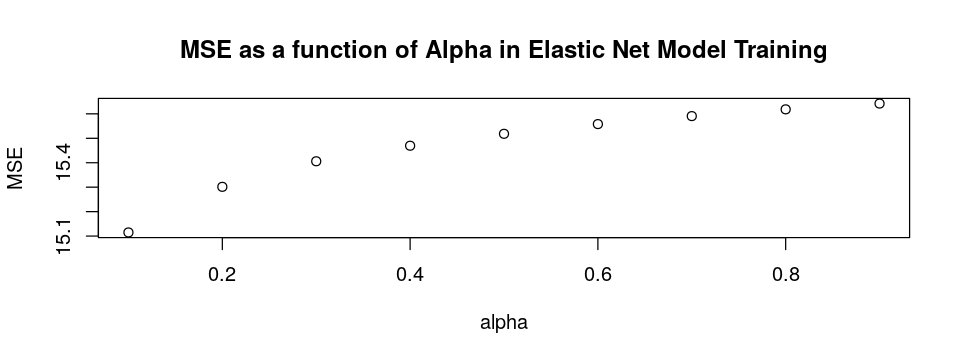
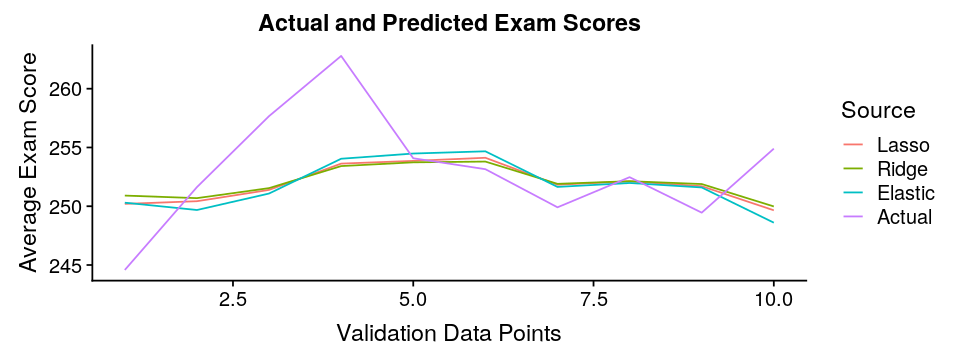
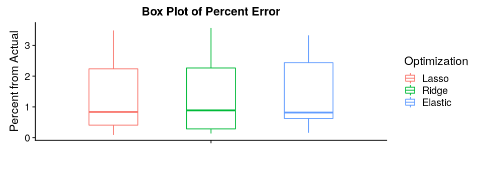
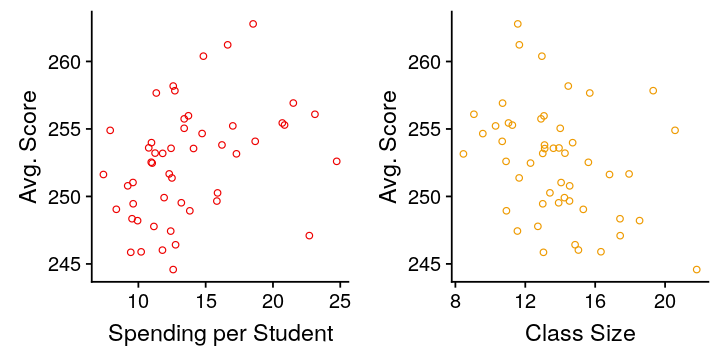
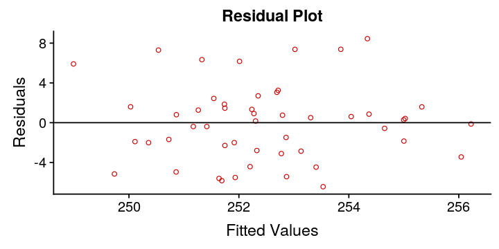
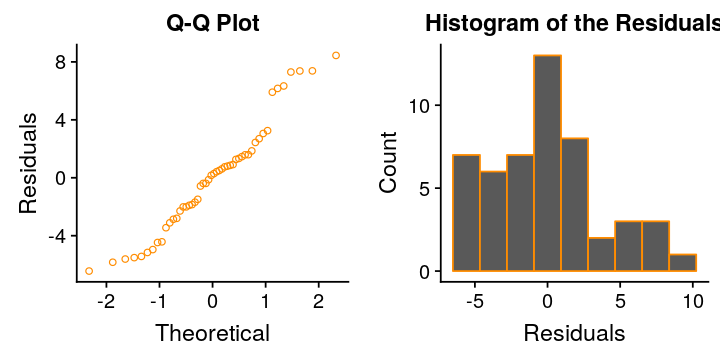

# Estimating U.S. examination results from multiple features
---

This dataset combines data from multiple sources:

* Kaggle's [U.S. Education Datasets: Unification Project](https://www.kaggle.com/noriuk/us-education-datasets-unification-project), specifically 2015 spending and average reading and math scores
* National Center for Education Statistics' [2011-2012 Schools and Staffing Survey (SASS)](https://nces.ed.gov/surveys/sass/tables/sass1112_2013314_t1s_001.asp), and it includes the total number of teachers by state for the 2011-2012 school year.  This is the latest available year posted on their website.

You can follow the process of preparing the combined dataset in my exploratory analyses:

* [Is there a relationship between U.S. state spending per student and examination results?](/edu/us_state_education/)
* [Working with missing data to estimate the total number of U.S. teachers by state](eda/impute_us_teachers)

The dataset contains the following features:

Feature|Description|Interaction Term
-|-|-
STATE|State Name|-
TEACHERS|Total estimated number of teachers 2011-2012|-
ENROLL|Total estimated enrollment of students 2015|-
TOTAL_EXPENDITURE|Total estimated expenditure on education 2015 (x1000)|-
AVG_SCORE|Average combined reading and math score per student 2015|-
STUDENT_EXP|Average total expenditure per student (TOTAL_EXPENDITURE/ENROLL)|X
CLASS_SIZE|Average class size (ENROLL/TEACHERS)|X

You can download it [here](states_imputed.csv).

## Setting Up

```R
# Import the libraries
suppressMessages(library(dplyr))
suppressMessages(library(car))
suppressMessages(library(GGally))
suppressMessages(library(cowplot))
suppressMessages(library(glmnet))

# Import custom function(s)
source('../../functions/split_indices.R')

# Create a universal seed value
seed = 111

# Import the data
df_edu = read.csv('states_imputed.csv', header=TRUE)
# Show the data frame
cat('Total Rows:', nrow(df_edu))
head(df_edu,3)
```
<div class="output">
<pre>
Total Rows: 50
</pre>
</div>

<table>
<thead><tr><th scope=col>STATE</th><th scope=col>TEACHERS</th><th scope=col>ENROLL</th><th scope=col>TOTAL_EXPENDITURE</th><th scope=col>AVG_SCORE</th><th scope=col>STUDENT_EXP</th><th scope=col>CLASS_SIZE</th></tr></thead>
<tbody>
	<tr><td>ALABAMA  </td><td>45000    </td><td>734974   </td><td>7501799  </td><td>245.9005 </td><td>10.206890</td><td>16.33    </td></tr>
	<tr><td>ALASKA   </td><td> 7500    </td><td>130755   </td><td>2968341  </td><td>247.0921 </td><td>22.701549</td><td>17.43    </td></tr>
	<tr><td>ARIZONA  </td><td>61700    </td><td>944978   </td><td>7902600  </td><td>249.0399 </td><td> 8.362734</td><td>15.32    </td></tr>
</tbody>
</table>

Now that we have the data available, we will select the optimal predictors and their corresponding coefficients using:

1. Lasso Regression
2. Ridge Regression
3. Elastic Net Regression

For these three regression models to optimize properly, the data need to be scaled.  We could scale the data ourselves, but the `glmnet()` function that we will be using can scale the data automatically for us.

Before jumping straight into creating the models, let's quickly look at the data.

## Exploratory Data Analysis

```R
# Set the image dimensions
options(repr.plot.width=9, repr.plot.height=6)
# Plot the corelations between the attributes
ggpairs(df_edu[c('TEACHERS', 'ENROLL', 'TOTAL_EXPENDITURE', 'STUDENT_EXP',
                 'CLASS_SIZE', 'AVG_SCORE')], aes(alpha=0.1))
```



There appears to be some multicollinearity between predictors.  Specifically, ENROLL, TEACHERS, and TOTAL_EXPENDITURE:

Pred A|Pred B|Correlation
-|-|-
ENROLL|TEACHERS|0.952
ENROLL|TOTAL_EXPENDITURE|0.937
TOTAL_EXPENDITURE|TEACHERS|0.954

This makes senses considering that states with more students need more teachers and will spend more money on education.

When creating our models, we will want to check for multicollinearity as it could affect the independence of the residuals of our model.

## Training and Validation Sets

Before creating our multiple linear regression models, we will split the data into 80% training and 20% validation sets.  I am using a [function](functions/split_indices) that I created to split the data.

This will enable us to see how well the models generalize to new data and select the best model accordingly.

```R
# Get the indices for the training, validation, and testing sets
idc = split_indices(nrow(df_edu), 0.8, 0.2, seed=seed)

# Set the training, validation, and testing sets
train = df_edu[idc$train,]
valid = df_edu[idc$valid,]

# Store the quantitative predictors for variable selection
predictors = c('TEACHERS', 'ENROLL', 'TOTAL_EXPENDITURE', 'STUDENT_EXP',
            'CLASS_SIZE')

# Set the x and y for training the model
xtrain = as.matrix(train[,predictors])
ytrain = as.vector(train$AVG_SCORE)
# Set the x and y for validating the model
xvalid = as.matrix(valid[,predictors])
yvalid = as.vector(valid$AVG_SCORE)
# Set the x and y for validating the model
xfull = as.matrix(df_edu[,predictors])
yfull = as.vector(df_edu$AVG_SCORE)
```

## Lasso - L1 Regularization

Lasso is an optimization process that forces coefficients to zero to simplify the model.  It minimizes the sum of squared errors of the model subject to the sum of the absolute value of the coefficients being less than a threshold value, $\lambda$.

Given $j=1,..,p$ predictors and $i=1,...,n$ data points:

$$\hat{y}_i = a_0 + a_1x_{1i}+a_2x_{2i}+...+a_px_{pi}$$

Minimize:

$$\Sigma_{i=1}^n (y_i - \hat{y}_i)$$

Subject to:

$$\Sigma_{j=1}^p |a_j| \leq \lambda$$

Note: The data need to be standardized for Lasso to work.  Fortunately, the `glmnet()` function provides a parameter for standardizing the data automatically.

```R
# Set our seed value
set.seed(seed)

# Use Cross-validation to find the optimal lambda range
cv_lasso = cv.glmnet(xtrain, ytrain, family="gaussian", type.measure="mse",
                     alpha=1, standardize=TRUE)

# Train the Lasso model on the entire training set using the optimal lambda
lm_lasso = glmnet(xtrain, ytrain, family ="gaussian", alpha=1,
                  lambda=cv_lasso$lambda.min, standardize=TRUE)
# Grab all of the coefficients of the Lasso model
lasso_coef = as.matrix(coef(lm_lasso))
# Drop any coefficients that are zero
lasso_coef = lasso_coef[lasso_coef[, "s0"] != 0,]

# Get the "best" predictors selected by Lasso regression
lasso_p = as.vector(attributes(lasso_coef)$names)
# Drop the Intercept
lasso_p = lasso_p[2:length(lasso_p)]

cat('Lasso regression predictors and coefficients:')
lasso_coef
```

<div class="output">
<pre>
    Lasso regression predictors and coefficients:
</pre>
</div>

<dl class=dl-horizontal>
	<dt>(Intercept)</dt>
		<dd>252.988112953793</dd>
	<dt>STUDENT_EXP</dt>
		<dd>0.178615527445116</dd>
	<dt>CLASS_SIZE</dt>
		<dd>-0.23087589247921</dd>
</dl>

Lasso selected spending per student and class size as the optimal predictors for the model.  Let's see how Ridge Regression optimizes the predictors.

## Ridge Regression

Ridge regression is an optimization process that also shrinks coefficients to zero to simplify the model.  However, the coefficients do not actually hit zero.  So it is not really a variable selection process.  It minimizes the sum of squared errors of the model subject to the sum of the squares of the coefficients being less than a threshold value, $\lambda$.

Given $j=1,..,p$ predictors and $i=1,...,n$ data points:

$$\hat{y}_i = a_0 + a_1x_{1i}+a_2x_{2i}+...+a_px_{pi}$$

Minimize:

$$\Sigma_{i=1}^n (y_i - \hat{y}_i)$$

Subject to:

$$\Sigma_{j=1}^p a_j^2 \leq \lambda$$

```R
# Set our seed value
set.seed(seed)

# Use Cross-validation to find the optimal lambda range
cv_ridge = cv.glmnet(xtrain, ytrain, family="gaussian",
                     type.measure="mse", alpha=0, standardize=TRUE)

# Train the ridge model on the entire training set using the optimal lambda
lm_ridge = glmnet(xtrain, ytrain, family ="gaussian", alpha=0,
                  lambda=cv_ridge$lambda.min, standardize=TRUE)
# Grab all of the coefficients of the ridge model
ridge_coef = as.matrix(coef(lm_ridge))
# Drop any coefficients that are zero
ridge_coef = ridge_coef[ridge_coef[, "s0"] != 0,]

# Get the "best" predictors selected by ridge regression
ridge_p = as.vector(attributes(ridge_coef)$names)
# Drop the Intercept
ridge_p = ridge_p[2:length(ridge_p)]

cat('Ridge regression predictors and coefficients:')
ridge_coef
```

<div class="output">
<pre>
    Ridge regression predictors and coefficients:
</pre>
</div>

<dl class=dl-horizontal>
	<dt>(Intercept)</dt>
		<dd>253.247519867578</dd>
	<dt>TEACHERS</dt>
		<dd>7.87785727398363e-07</dd>
	<dt>ENROLL</dt>
		<dd>2.4988816521527e-08</dd>
	<dt>TOTAL_EXPENDITURE</dt>
		<dd>2.89882741239528e-09</dd>
	<dt>STUDENT_EXP</dt>
		<dd>0.134873755454632</dd>
	<dt>CLASS_SIZE</dt>
		<dd>-0.213030660881126</dd>
</dl>

As mentioned above, none of the coefficients were set to zero.

What is interesting to see is that holding all other factors constant, as ENROLL increases, the AVG_SCORE decreases.  This appears to be mostly offset by the TEACHERS predictor however.

## Elastic Net Regression - Combining L1 and L2 Regularization

Elastic Net Regression balances between Lasso and Ridge regression by combining both.  It minimizes the sum of squared errors of the model subject to the sum of the absolute value of the sum of the squares of the coefficients being less than a threshold value, $\lambda$.

Given $j=1,..,p$ predictors and $i=1,...,n$ data points:

$$\hat{y}_i = a_0 + a_1x_{1i}+a_2x_{2i}+...+a_px_{pi}$$

Minimize:

$$\Sigma_{i=1}^n (y_i - \hat{y}_i)$$

Subject to:

$$\alpha \Sigma_{j=1}^p |a_j| + (1-\alpha)\Sigma_{j=1}^p a_j^2 \leq \lambda$$

Where $\alpha$ is a value between 0 and 1.

```R
# Initialize a dataframe to hold the alpha values and the MSE
alpha_cost = data.frame('alpha'=numeric(), 'MSE'=numeric())

# Loop through alpha values from 0.01 to 0.99
for(alpha in seq(from=0.1, to=0.9, by=0.1)) {
    # Set the seed value
    set.seed(seed)
    # Use Cross-validation to find the optimal lambda range
    cv_elast = cv.glmnet(xtrain, ytrain, family = "gaussian",
                         type.measure="mse", alpha=alpha, standardize=TRUE)
    # Store the alpha value and the corresponding minimum mean squared error
    alpha_cost = rbind(alpha_cost, data.frame('alpha'=alpha,
                                               'MSE'=min(cv_elast$cvm)))
}

# Show the best alpha value
cat('Best Alpha value:')
alpha_cost[which.min(alpha_cost$MSE),]
alpha_best = alpha_cost[which.min(alpha_cost$MSE),]$alpha

# Set the figure dimensions
options(repr.plot.width=8, repr.plot.height=3)
# Plot the alpha performance
plot(alpha_cost)
title('MSE as a function of Alpha in Elastic Net Model Training')

```

<div class="output">
<pre>
Best Alpha value:
</pre>
</div>

<table>
<thead><tr><th scope=col>alpha</th><th scope=col>MSE</th></tr></thead>
<tbody>
	<tr><td>0.1     </td><td>15.35004</td></tr>
</tbody>
</table>



Using MSE as the cost function, the "best" α value is 0.1. This suggests that the Elastic Net model most favors shrinking the coefficients, rather than zeroing them out. I would expect that with an α value so near to zero, no predictors will be removed from the model.

```R
# Train the elast model on the entire training set using the optimal lambda
lm_elast = glmnet(xtrain, ytrain, family ="gaussian", alpha=alpha_best,
                  lambda=cv_elast$lambda.min)
# Grab all of the coefficients of the elast model
elast_coef = as.matrix(coef(lm_elast))
# Drop any coefficients that are zero
elast_coef = elast_coef[elast_coef[, "s0"] != 0,]

# Get the "best" predictors selected by elast regression
elast_p = as.vector(attributes(elast_coef)$names)
# Drop the Intercept
elast_p = elast_p[2:length(elast_p)]

cat('Elastic Net regression predictors and coefficients:')
elast_coef
```

<div class="output">
<pre>
Elastic Net regression predictors and coefficients:
</pre>
</div>

<dl class=dl-horizontal>
	<dt>(Intercept)</dt>
		<dd>253.574629514752</dd>
	<dt>ENROLL</dt>
		<dd>2.39209643201802e-07</dd>
	<dt>TOTAL_EXPENDITURE</dt>
		<dd>-3.97412352810693e-09</dd>
	<dt>STUDENT_EXP</dt>
		<dd>0.225802914460005</dd>
	<dt>CLASS_SIZE</dt>
		<dd>-0.334408781346008</dd>
</dl>

## Brief Review of LP-Norm Regularization

The penalty term for Lasso regression uses L1 regularization, namely, the sum of the absolute value of the coefficients.  The penalty term for Ridge regression uses L2 regularization, namely, the sum of the squares of the coefficients.  We can generalize this formula to be LP regularization, where P can take any value from from 0 (exclusive) to infinity.

Given $n$ data points and $p$ dimensions:

$$||X||_p = (\Sigma_{i=1}^n|x_i|^p)^{1/p}$$

Let's normalize some normally distributed random data and normalize it using the various P values.

```R
# Randomly sample 10000 data points from a normal distribution
x = rnorm(10000)
y = rnorm(10000)

# Set the p-values to graph
p_vals = c(0.5, 1, 2, 4, 200)
# Create a toggle when the loop has gone through once
at_start = TRUE

# Loop through the p-values to compute the normalized x and y values
for (p in p_vals) {
    # Get the current p-norm
    p_norms = (abs(x)**p+abs(y)**p)**(1/p)
    # Normalize x and y using the current p value
    xn = x / p_norms
    yn = y / p_norms
    # Create a data frame of the current normalized values
    cur_norms = data.frame(cbind(xn,yn))
    # Add the p-value to the data frame
    if(p > 100)
        cur_norms$p = 'inf'
    else
        cur_norms$p = p
    # If at the start, set the normalized data frame to the
    # current norms
    if(at_start)
        normalized = cur_norms
    # Otherwise append the current norms to the existing normalized
    # data frame
    else
        normalized = rbind(normalized, cur_norms)
    # Toggle the at start
    at_start = FALSE
}

# Set the figure dimensions
options(repr.plot.width=4, repr.plot.height=3)
# Plot the p-norms
ggplot(normalized, aes(xn,yn,color=p)) +
    geom_point(size = 0.5)
```


When p=1, we have a rotated square, with vertices at (0,1), (1,0), (-1,0), and (0,-1).

As p approaches zero from p=1, the center of the faces bend towards the origin.  Conversely, as p approaches infinity from p=1, the center of the faces approaches the points (1,1), (1,-1), (-1,1), and (-1,-1).

## Model Selection

Now that we have the three models:

1. Lasso
2. Ridge
3. Elastic Net

Let's select the best model by comparing their relative performance on the validation set.

```R
# Validate the Lasso Model
model_name = 'Lasso'
# Grab the predicted values
las_pred_val = predict(lm_lasso, xvalid, s=lm_lasso$lambda.min)
# Compute the percent error of the predicted values
err = abs(las_pred_val - valid$AVG_SCORE) / valid$AVG_SCORE * 100
errors = data.frame('Point'=seq(1,nrow(valid)),
                         'Optimization'=rep(model_name, nrow(valid)),
                         'Pct.Error'=err[,1])
crime_rates = data.frame('Point'=seq(1,nrow(valid)),
                          'Source'=rep(model_name, nrow(valid)),
                          'AVG_SCORE'=las_pred_val)
colnames(crime_rates) = c('Point', 'Source', 'AVG_SCORE')
```

```R
# Validate the Ridge Model
model_name = 'Ridge'
# Grab the predicted values
rdg_pred_val = predict(lm_ridge, xvalid, s=lm_ridge$lambda.min)
# Compute the percent error of the predicted values
err = abs(rdg_pred_val - valid$AVG_SCORE) / valid$AVG_SCORE * 100
tmp = data.frame('Point'=seq(1,nrow(valid)),
                         'Optimization'=rep(model_name, nrow(valid)),
                         'Pct.Error'=err[,1])
errors = rbind(errors,tmp)
tmp = data.frame('Point'=seq(1,nrow(valid)),
                          'Source'=rep(model_name, nrow(valid)),
                          'AVG_SCORE'=rdg_pred_val)
colnames(tmp) = c('Point', 'Source', 'AVG_SCORE')
crime_rates = rbind(crime_rates, tmp)
```

```R
# Validate the Elastic Net Model
model_name = 'Elastic'
# Grab the predicted values
els_pred_val = predict(lm_elast, xvalid, s=lm_elast$lambda.min)
# Compute the percent error of the predicted values
err = abs(els_pred_val - valid$AVG_SCORE) / valid$AVG_SCORE * 100
tmp = data.frame('Point'=seq(1,nrow(valid)),
                         'Optimization'=rep(model_name, nrow(valid)),
                         'Pct.Error'=err[,1])
errors = rbind(errors,tmp)
tmp = data.frame('Point'=seq(1,nrow(valid)),
                          'Source'=rep(model_name, nrow(valid)),
                          'AVG_SCORE'=els_pred_val)
colnames(tmp) = c('Point', 'Source', 'AVG_SCORE')
crime_rates = rbind(crime_rates, tmp)
```

```R
# Store the Actual crime rates in a dataframe
crime_rates = rbind(crime_rates,
                     data.frame('Point'=seq(1,nrow(valid)),
                          'Source'=rep('Actual', nrow(valid)),
                          'AVG_SCORE'=valid$AVG_SCORE))

# Show the mean percent error of each function
overall_results = aggregate(errors$Pct.Error,
                             by=list(errors$Optimization), mean)
colnames(overall_results) = c('Optimization', 'Mean.Pct.Error')

# Calculate the root mean squared errors of the models
overall_results$RMSE = c(sum((las_pred_val - valid$AVG_SCORE)^2)/
                          length(valid$AVG_SCORE),
                          sum((rdg_pred_val - valid$AVG_SCORE)^2)/
                          length(valid$AVG_SCORE),
                          sum((els_pred_val - valid$AVG_SCORE)^2)/
                          length(valid$AVG_SCORE))

# Show the total number of predictors selected
overall_results$Predictors = c(length(lasso_p), length(ridge_p),
                               length(elast_p))
```

```R
# Set the figure dimensions
options(repr.plot.width=8, repr.plot.height=3)
# Show the graph of the actual and predicted Crime Rates
ggplot(crime_rates, aes(x=Point, y=AVG_SCORE, col=Source)) +
    geom_line() +
    xlab('Validation Data Points') +
    ylab('Average Exam Score') +
    ggtitle('Actual and Predicted Exam Scores')
```



```R
# Show the box plot of the Percent Error
ggplot(errors, aes(x='', y=Pct.Error, col=Optimization)) +
    geom_boxplot(width = 0.5,
                 position=position_dodge(width=1)) +
    xlab('') +
    ylab('Percent from Actual') +
    ggtitle('Box Plot of Percent Error')
```



```R
# Show the results
overall_results
```

<table>
<thead><tr><th scope=col>Optimization</th><th scope=col>Mean.Pct.Error</th><th scope=col>RMSE</th><th scope=col>Predictors</th></tr></thead>
<tbody>
	<tr><td>Lasso   </td><td>1.303530</td><td>19.37022</td><td>2       </td></tr>
	<tr><td>Ridge   </td><td>1.313202</td><td>20.09249</td><td>5       </td></tr>
	<tr><td>Elastic </td><td>1.397516</td><td>20.63286</td><td>4       </td></tr>
</tbody>
</table>

All three models perform similarly, but the Lasso regression model that uses only two predictors performs the best on the validation set.

Let's train a multiple linear regression model on the full dataset using the two predictors selected by Lasso regression, namely STUDENT_EXP and CLASS_SIZE.

```R
model = lm(AVG_SCORE~STUDENT_EXP+CLASS_SIZE, df_edu)
summary(model)
```

<div class="output">
<pre>    
Call:
lm(formula = AVG_SCORE ~ STUDENT_EXP + CLASS_SIZE, data = df_edu)

Residuals:
    Min      1Q  Median      3Q     Max
-6.4404 -2.6728  0.2273  1.5927  8.4468

Coefficients:
            Estimate Std. Error t value Pr(>|t|)    
(Intercept) 253.4486     4.7767  53.060   <2e-16 ***
STUDENT_EXP   0.2413     0.1593   1.514    0.137    
CLASS_SIZE   -0.3095     0.2322  -1.333    0.189    
---
Signif. codes:  0 ‘ *** ’ 0.001 ‘ ** ’ 0.01 ‘ * ’ 0.05 ‘.’ 0.1 ‘ ’ 1

Residual standard error: 3.91 on 47 degrees of freedom
Multiple R-squared:  0.1557,	Adjusted R-squared:  0.1197
F-statistic: 4.333 on 2 and 47 DF,  p-value: 0.01875
</pre>
</div>

$$AVG\_SCORE = 253.45 + 0.24\ STUDENT\_EXP - 0.31\ CLASS\_SIZE$$

We can see that for a 1 student increase in average class size, holding spending per student constant, the average score decreases by 0.31 points.  Holding class size constant, as spending per student increases by USD 1,000, the average score increases by 0.24.

Additionally, we can see that neither predictor is significant with p-values above the the $\alpha$ threshold of 0.05.

## Evaluating the fit of the model

To evaluate the fit of the model, we need to check the model's assumptions, namely:

* Linearity / Mean Zero Assumption $E(\epsilon_i) = 0$
* Constant Variance Assumption $Var(\epsilon_i) = \sigma^2$
* Normality Assumption $\epsilon \sim N(0,\sigma^2)$
* Independence Assumption $\epsilon_i,...,\epsilon_n$ are independent

### Linearity / Mean Zero Assumption $E(\epsilon_i) = 0$
To assess the linearity / mean zero assumption we will look at the scatter plot of the residuals against the average total spending per student.

```R
# Create an analysis data frame
analysis = df_edu
# Append the residuals and fitted values to the data
analysis$residuals = model$residuals
analysis$fitted = model$fitted

# Set the image dimensions
options(repr.plot.width=6, repr.plot.height=3)
# Create scatter plot of the log of affiars against occupation prestige
plt_occ = ggplot(analysis, aes(x=STUDENT_EXP, y=AVG_SCORE)) +
geom_jitter(shape=1, color='red2') +
xlab('Spending per Student') +
ylab('Avg. Score')
# Create scatter plot of the log of affiars against marriage rank
plt_mar = ggplot(analysis, aes(x=CLASS_SIZE, y=AVG_SCORE)) +
    geom_point(shape=1, color='orange2') +
    xlab('Class Size') +
    ylab('Avg. Score')
# Grid them together
plot_grid(plt_occ, plt_mar, ncol=2)
```



The linearity/mean zero assumption appears to hold.  Spending per student appears to trend linearly positively with average score, and class size appears to trend linearly negatively with average score.

### Constant Variance Assumption $Var(\epsilon_i) = \sigma^2$

To assess the constant variance assumption we will look at the scatterplots of the residuals against the fitted values.  We are looking for [homoskedasticity](https://en.wikipedia.org/wiki/Homoscedasticity).

```R
# Set the image dimensions
options(repr.plot.width=6, repr.plot.height=3)
# Residual Plot
ggplot(analysis, aes(x=fitted, y=residuals)) +
geom_point(shape=1, color='red3') +
    geom_abline(intercept = 0, slope = 0) +
    xlab('Fitted Values') +
    ylab('Residuals') +
    ggtitle("Residual Plot")
```



The variance of the residuals against the fitted values appears to be constant.  Let's run the Non-constant variance test on the model to check it algorithmically.

```R
ncvTest(model)
```

<div class="output">
<pre>
Non-constant Variance Score Test
Variance formula: ~ fitted.values
Chisquare = 0.3697145, Df = 1, p = 0.54316
</pre>
</div>

With a p-value of 0.54, we can reasonably conclude that the residuals have constant variance.

### Normality Assumption $\epsilon \sim N(0,\sigma^2)$

To assess the normality assumption we will look at the QQ plot of the residuals and the histogram of the residuals.

```R
# Set the image dimensions
options(repr.plot.width=6, repr.plot.height=3)
# Normal Q-Q Plot
plt_qq = ggplot(analysis, aes(sample=residuals)) +
    stat_qq(shape=1, color='darkorange') +
    xlab('Theoretical') +
    ylab('Residuals') +
    ggtitle("Q-Q Plot")
# Histogram of Residuals
plt_hst = ggplot(analysis, aes(residuals)) +
    geom_histogram(bins=9, color='darkorange') +
    xlab('Residuals') +
    ylab('Count') +
    ggtitle("Histogram of the Residuals")
# Grid them together
plot_grid(plt_qq, plt_hst, ncol=2)
```



The Q-Q plot indicates that there is a light negative tail.  The histogram of the residuals also confirms that it has a light negative tail.  Let's run the Shapiro-Wilk test on the residuals to see if they are normally distributed.

```R
# Run the Shapiro Test
sw_results <- shapiro.test(analysis$residuals)
cat('Shapiro-Wilk p-value:', sw_results$p.value)
```

<div class="output">
<pre>
Shapiro-Wilk p-value: 0.06858472
</pre>
</div>

With a p-value of 0.07, we do not reject the null hypothesis that the residuals are normally distributed.  However, with it being so close to the $alpha$ threshold of 0.5, the full population are potentially not normally distributed.

### Independence Assumption $\epsilon_i,...,\epsilon_n$ are independent

Although we can not conclusively state that the residuals are independent, we can use a fairly good proxy by checking for multicollinearity between the two predictors.

```R
cor(analysis$STUDENT_EXP, analysis$CLASS_SIZE)
```

<div class="output">
<pre>
-0.531675802778805
</pre>
</div>

There is a moderate negative correlation between spending per student and class size. Increases spending per student moderately correlates with smaller class sizes. This makes sense given that larger budgets can employ more teachers and reduce class sizes.

This may suggest multicollinearity, but let's check the [variance inflation factor](https://en.wikipedia.org/wiki/Variance_inflation_factor) (VIF) for the model.  The VIF indicates how much the standard error of the predictor coefficient has increased, if that predictor correlates with the other predictors.

There is no hard cutoff of the VIF for determining if there is multicollinearity, but some standard values are 10, 8, or even 5.

```R
vif(model)
```

<dl class=dl-horizontal>
	<dt>STUDENT_EXP</dt>
		<dd>1.39407632290324</dd>
	<dt>CLASS_SIZE</dt>
		<dd>1.39407632290324</dd>
</dl>

We can see that the VIF value is only 1.39, which suggests that we are not seeing significant multicollinearity between the two predictors.  We can reasonably conclude that the independence assumption holds.

## Conclusions

The model passes all four assumptions, and we can reasonably conclude that it is a good fit for the data.  With that said, we can see from the low Adjusted $R^2$ value of 0.12 that it is not a very good predictor of average student scores.

### Next Steps

As a possible next step, we could investigate if there is any statistically significant difference in the results based on the region of the state.
