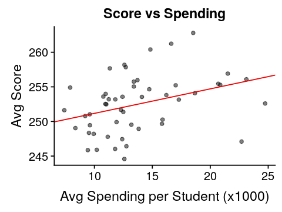
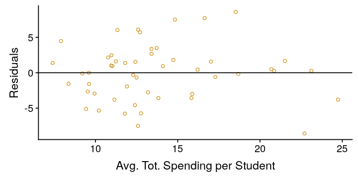
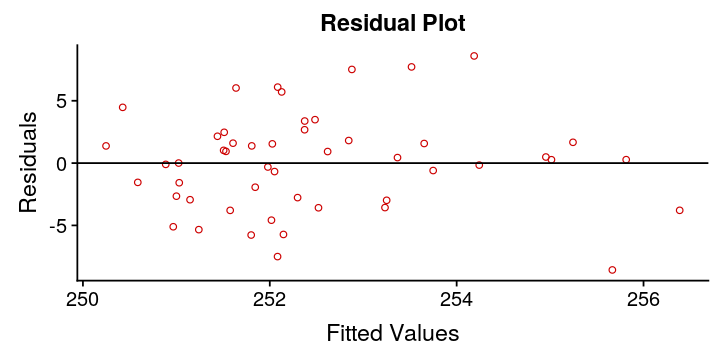
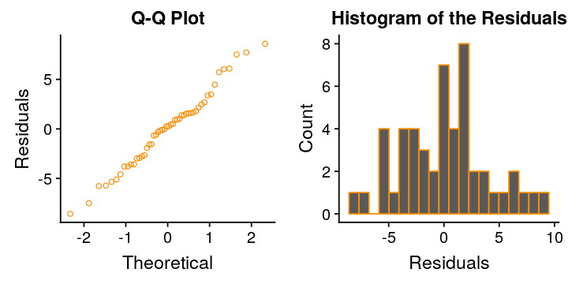

# Estimating U.S. examination results from spending per student and average class size
---

This dataset comes from Kaggle's [U.S. Education Datasets: Unification Project](https://www.kaggle.com/noriuk/us-education-datasets-unification-project).  I have already preprocessed the dataset to select the average scores and average spending per student.  [Download it here.](states2015.csv)  You can follow that process in my exploratory analyses:

1. [Is there a relationship between U.S. state spending per student and examination results?](/edu/us_state_education/)
2. Imputation: [Working with missing data - Total number of U.S. teachers by state](eda/impute_us_teachers)

## Setting Up

```R
# Import the libraries
suppressMessages(library(dplyr))
suppressMessages(library(car))
suppressMessages(library(GGally))
suppressMessages(library(cowplot))

# Import the data
df_2015 = read.csv('states2015.csv', header=TRUE)
# Show the data frame
cat('Total Rows:', nrow(df_2015))
head(df_2015,3)
```
<div class="output">
<pre>
Total Rows: 50
</pre>
</div>

<table>
<thead><tr><th >STATE</th><th >AVG_SCORE</th><th >AVG_TOT_EXP</th></tr></thead>
<tbody>
	<tr><td>ALABAMA  </td><td>245.9005 </td><td>10.206890</td></tr>
	<tr><td>ALASKA   </td><td>247.0921 </td><td>22.701549</td></tr>
	<tr><td>ARIZONA  </td><td>249.0399 </td><td> 8.362734</td></tr>
</tbody>
</table>

Now that we have the data available, we are ready to create a simple linear regression model.

```R
model = lm(AVG_SCORE ~ AVG_TOT_EXP, df_2015)
summary(model)
```
<div class="output">
<pre>    
Call:
lm(formula = AVG_SCORE ~ AVG_TOT_EXP, data = df_2015)

Residuals:
    Min      1Q  Median      3Q     Max
-8.5742 -2.8968  0.2726  1.7751  8.5980

Coefficients:
            Estimate Std. Error t value Pr(>|t|)    
(Intercept) 247.6250     1.9463 127.228   <2e-16 ***
AVG_TOT_EXP   0.3542     0.1360   2.604   0.0122 *  
---
Signif. codes:  0 ‘ *** ’ 0.001 ‘ ** ’ 0.01 ‘ * ’ 0.05 ‘.’ 0.1 ‘ ’ 1

Residual standard error: 3.942 on 48 degrees of freedom
Multiple R-squared:  0.1237,	Adjusted R-squared:  0.1055
F-statistic: 6.779 on 1 and 48 DF,  p-value: 0.01224
</div>
</pre>

Let's look at a scatterplot of the data points and the linear regression line.

```R
# Get the coefficients
x0 = model$coeff[[1]]
x1 = model$coeff[[2]]
# Create the scatterplot of score vs expenditure
# with the regression line
options(repr.plot.width=4, repr.plot.height=3)
ggplot(df_2015,aes(x=AVG_TOT_EXP,y=AVG_SCORE)) +
    geom_point(alpha=0.5) +
    geom_abline(intercept = x0, slope = x1, color='red2') +
    xlab('Avg Spending per Student (x1000)') +
    ylab('Avg Score') +
    ggtitle('Score vs Spending')
```



The regression line trends fairly well with the data points, and it does appear to be a linear relationship.

## Evaluating the fit of the model

To evaluate the fit of the model, we need to check the model's assumptions, namely:

* Linearity / Mean Zero Assumption $E(\epsilon_i) = 0$
* Constant Variance Assumption $Var(\epsilon_i) = \sigma^2$
* Normality Assumption $\epsilon \sim N(0,\sigma^2)$
* Independence Assumption $\epsilon_i,...,\epsilon_n$ are independent

### Linearity / Mean Zero Assumption $E(\epsilon_i) = 0$
To assess the linearity / mean zero assumption we will look at the scatter plot of the residuals against the average total spending per student.

```R
# Create an analysis data frame
analysis = df_2015
# Append the residuals and fitted values to the data
analysis$residuals = model$residuals
analysis$fitted = model$fitted
# Set the image dimensions
options(repr.plot.width=6, repr.plot.height=3)
# Create a scatter plot of the residuals against spending
ggplot(analysis, aes(x=AVG_TOT_EXP, y=residuals)) +
    geom_point(shape=1, color='orange3') +
    geom_abline(intercept = 0, slope = 0) +
    xlab('Avg. Tot. Spending per Student') +
    ylab('Residuals')
```



The linearity/mean zero assumption appears to hold.  There is no clear curvature to the residuals that may indicate a non-linear relationship.

### Constant Variance Assumption $Var(\epsilon_i) = \sigma^2$

To assess the constant variance assumption we will look at the scatterplots of the residuals against the fitted values.  We are looking for [homoskedasticity](https://en.wikipedia.org/wiki/Homoscedasticity).

```R
# Set the image dimensions
options(repr.plot.width=6, repr.plot.height=3)
# Residual Plot
ggplot(analysis, aes(x=fitted, y=residuals)) +
geom_point(shape=1, color='red3') +
    geom_abline(intercept = 0, slope = 0) +
    xlab('Fitted Values') +
    ylab('Residuals') +
    ggtitle("Residual Plot")
```



There may be a slight increase in variance as the fitted values increase.  However, with only 50 data points in this set, it is difficult to conclude from the figure above.

Fortunately, we can test it algorithmically with the **Non-Constant Variance (NVC) Test** from the `cars` package.

```R
ncvTest(model)
```
<div class="output">
<pre>
Non-constant Variance Score Test
Variance formula: ~ fitted.values
Chisquare = 1.056671, Df = 1, p = 0.30398
</pre>
</div>

With a p-value of 0.30, we do not reject the null hypothesis and can reasonably conclude that the data have constant variance.

### Normality Assumption $\epsilon \sim N(0,\sigma^2)$

To assess the normality assumption we will look at the QQ plot of the residuals and the histogram of the residuals.

```R
# Set the image dimensions
options(repr.plot.width=6, repr.plot.height=3)
# Normal Q-Q Plot
plt_qq = ggplot(analysis, aes(sample=residuals)) +
    stat_qq(shape=1, color='darkorange') +
    xlab('Theoretical') +
    ylab('Residuals') +
    ggtitle("Q-Q Plot")
# Histogram of Residuals
plt_hst = ggplot(analysis, aes(residuals)) +
    geom_histogram(bins=20, color='darkorange') +
    xlab('Residuals') +
    ylab('Count') +
    ggtitle("Histogram of the Residuals")
# Grid them together
plot_grid(plt_qq, plt_hst, ncol=2)
```



The Q-Q plot suggests that the residuals follow a normal distribution without significant positive or negative tails.  However, the histogram of residuals does not appear to be normally distributed.  Let's run the Shapiro-Wilk test on the residuals to see if they are normally distributed.

```R
# Run the Shapiro Test
sw_results <- shapiro.test(analysis$residuals)
cat('Shapiro-Wilk p-value:', sw_results$p.value)
```
<div class="output">
<pre>
Shapiro-Wilk p-value: 0.7254706
</pre>
</div>

With a p-value of 0.72, we do not reject the null hypothesis and can reasonably conclude that the residuals are normally distributed.

### Independence Assumption $\epsilon_i,...,\epsilon_n$ are independent

We are only using a single predictor, the total average spending per student, to estimate the average student scores.  Therefore, we do not need to check for multicollinearity between predictors and we can reasonable assume that the residuals are independent.

Given that the model has passed all of the assumption tests, we can conclude that it is a good fit for the data.

## Reviewing the linear regression model

```R
summary(model)
```

<div class="output">
<pre>    
Call:
lm(formula = AVG_SCORE ~ AVG_TOT_EXP, data = df_2015)

Residuals:
    Min      1Q  Median      3Q     Max
-8.5742 -2.8968  0.2726  1.7751  8.5980

Coefficients:
            Estimate Std. Error t value Pr(>|t|)    
(Intercept) 247.6250     1.9463 127.228   <2e-16 ***
AVG_TOT_EXP   0.3542     0.1360   2.604   0.0122 *  
---
Signif. codes:  0 ‘ *** ’ 0.001 ‘ ** ’ 0.01 ‘ * ’ 0.05 ‘.’ 0.1 ‘ ’ 1

Residual standard error: 3.942 on 48 degrees of freedom
Multiple R-squared:  0.1237,	Adjusted R-squared:  0.1055
F-statistic: 6.779 on 1 and 48 DF,  p-value: 0.01224
</pre>
</div>

Both the intercept and the average spending per student are significant, with p-values below the accepted $\alpha$ = 0.05 threshold.

From the model, for every additional \$1000 spent per student, the average student score will increase by 0.35 points.

Another way to state it is that for a 1 point increase in average score, the state needs to spend an additional \$2,823 per student.
